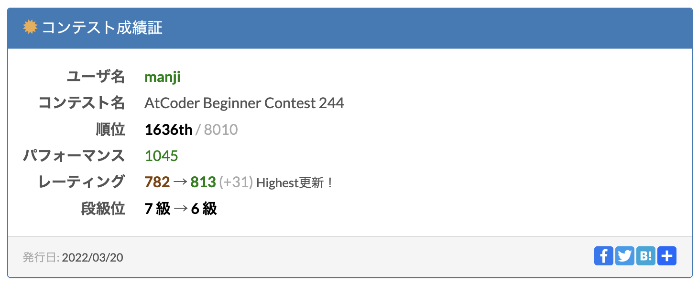
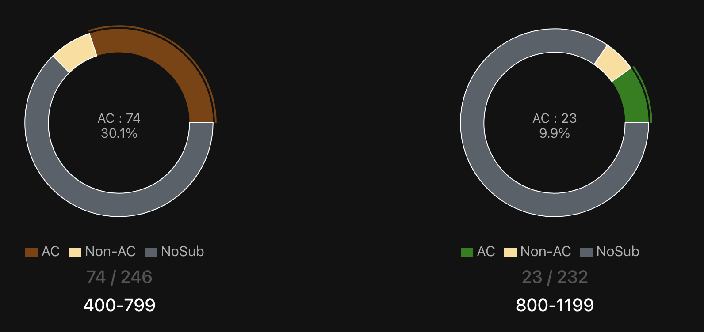
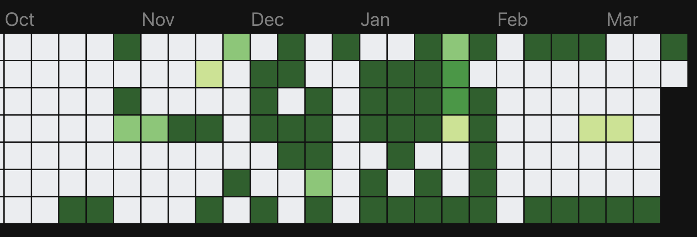
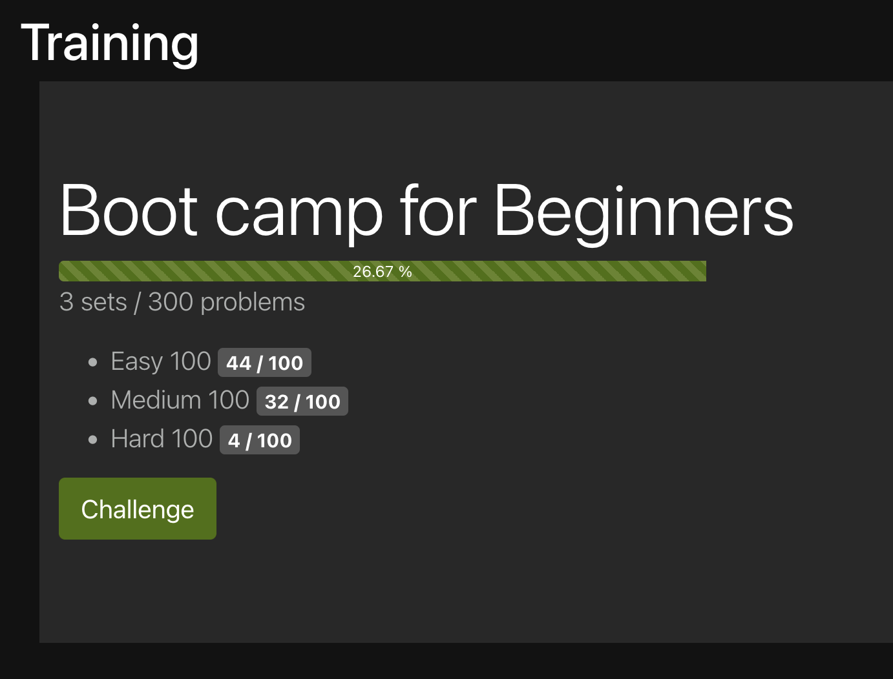

昨日のABC244で緑コーダーになれました。

## 精進の記録

参加し始めてからおおよそ5ヶ月くらい。精進はあんまりできてなかったです。

芝もあんまり生えてない。

ただ「やったこと」自体は実力向上に繋がっていたと思います。

* Two Pointers Technique (尺取り法含む)
* BIT、平方分割を使ったクエリ高速化
* UnionFindでシンプルに殴る
* 基礎中の基礎部分のDP

あたりは精進しながら書き方を覚えたもので、これらの知識がなかったら多分入緑はできなかったと思います。このあたりは茶\~緑diffを選んで3\~50問くらい解くと慣れます。

特にTwo Pointers Techniqueやその一部である尺取り法はめっちゃ大事です。この視点があるかどうかで茶diffのAC率が10%以上変わると思います。

また、

* 再帰を使わない深さ優先探索の書き慣れ (※Python勢なので再帰を使わないテクが地味に大事)
* 幅優先探索の書き慣れ
* set/dictなどのハッシュテーブルの使い慣れ
* collections.dequeやitertools.permutations/productなどの使い慣れ

あたりは「基礎的な処理を十分速く書けるようにする」ために大事です。これは灰~茶diffあたりの問題を選んで100問くらい解くと身に付くと思います。

上の2種類を合計150問くらい解いたら、緑コーダー向けの知識と経験が揃い得るのではないかと思います。(僕はそうなってた)

多分[AtCoder ProblemsのTraining](https://kenkoooo.com/atcoder/#/training)のEasy&Mediumを全部(計200問)解いたら余裕です。僕は解けてないですが。

## コンテストへの臨み方

Rated登録してたABCをすっぽかしてレートが100くらい下がったことがあったりしましたが、可能な限り毎回ABC/ARCには参加するようにしていました。

スムーズに解くコツとしては、以下の2つかなと感じてます。

* あらかじめAtCoder用環境を作っておくこと
    * PythonならVSCodeとpyenv+poetry+pypyを入れておき、入力やmain関数とかのテンプレを作っておくとすごい楽
* デカいディスプレイを2枚以上用意しておくこと
    * 1枚で問題+エディタを垂直分割で表示しておく
    * 2枚目以降でググる用のブラウザ窓を開いておいたり、気分転換のTwitterやiTunesの窓を置いておいたりする

特にテンプレとしてよく使う記述のsnipetを用意するのはかなりのストレス軽減になりました。

## 今後やること

### 緑diff以上の問題の解説を読めるように数学を勉強する
緑diffあたりからかなり解説に数学の記述が増えてきて、ぶっちゃけわけわかめです。数学なんも分からんから式変形の理屈を理解できないし、そもそも記号が読めん！なのでこのあたりをどうやってか勉強しなきゃなーと思ってます。

解説が読めるようにならないと解説ACする意義が無いし、そもそもページ開いた瞬間萎えてコードを写経することすら諦めて閉じちゃうことがよくあるので。

### 難しめの茶diffを落とさないようにDPを勉強する
解けない茶diffが割とあります。10問以上はあるんじゃないかな。

どっかで抜けてんですよ、知識。無くても緑にはなれるけど、入緑から上がっていくには抜けてる基礎がどっかでたちはだかってくるはずです。僕は学校の勉強が嫌いだったのでよく知ってるんだそういうのは。

感覚的にはDPです。DPの考え方を体系的に勉強しないとダメっぽい。でも漸化式を見るとアレルギーが出ちゃうのでやっぱ数学です。

### 日々よく寝る
なんだかんだこれが一番大事。仕事でも結局これがパフォーマンスに一番結び付いてるんですよね。ちゃんと飯食って寝ることはゲームプレイヤーとして一番優先しなきゃいけないこと。

---

緑って言ってもまだレート800。1100くらいでも同じく緑ランクなんですけど、実力的にはとても大きな差があると思います。道程はかなり長そうですが、半年で1100くらいはなんとかならないかなーとナメた見積をしてます。とりあえずやってみる。
