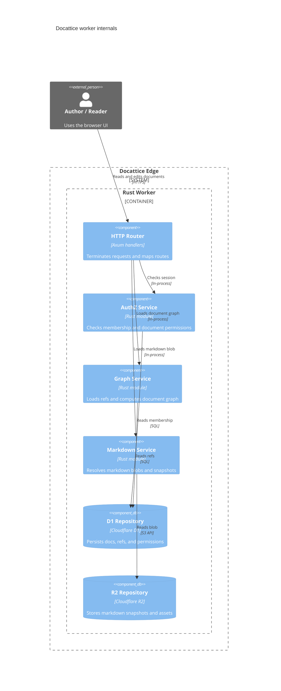
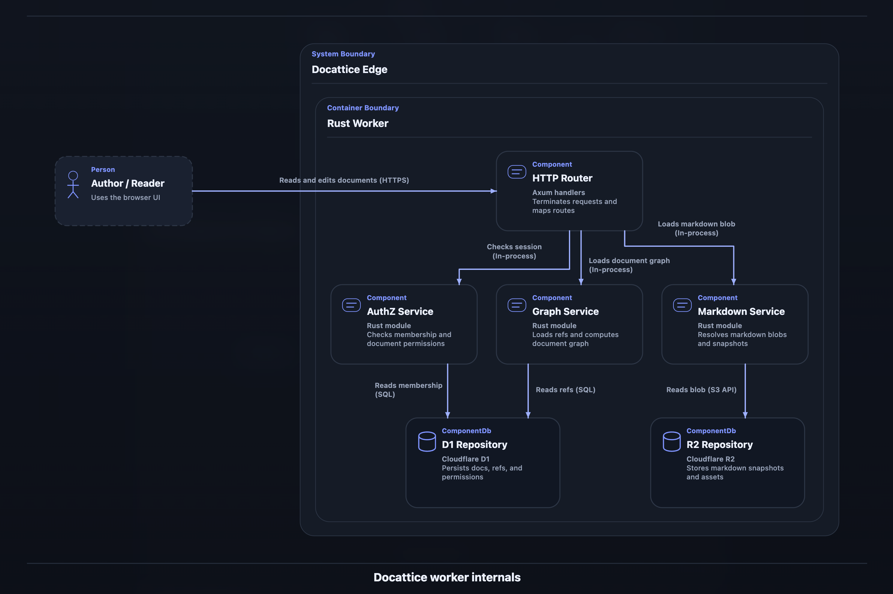
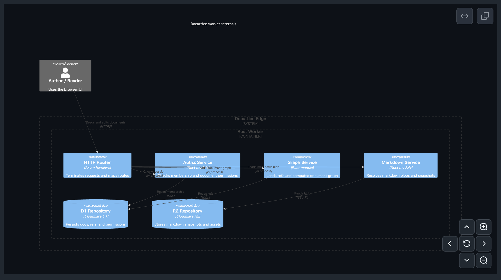
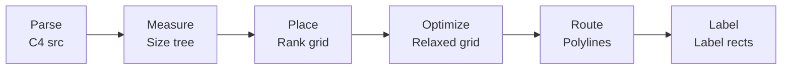

有給消化中の自由研究として、オリジナルの文書管理システムを作っている。今回のテーマは「Full Rust実装（Webフロントエンドも含む）」「文書の有向グラフ化による依存関係分析」「画像をサポートしないことによるフルテキスト化」で、今のところはうまく動いている。RBAC周りやセキュリティ実装をちゃんと詰めたら、知り合いにクローズド公開するつもり。

さて、画像をサポートしないとはいっても、技術文書を扱う以上Figma DSLやMermaidは当然レンダリングできないと困る。画像が嫌なのであって、図は当然大事。

最初は `beautiful-mermaid` で何とかなるだろうと思っていたが、思ったほど満足できなかったので自作することにした。

今回はその中でも、特に [C4 Model](https://c4model.com/) のレンダリングについて書く。

## C4Modelとは

ソフトウェアアーキテクチャを視覚化する手段として、Simon Brownが提唱した[C4Model](https://c4model.com/)は広く普及している。C4図を描くツールとしてはStructurizr、C4-PlantUML、Mermaid.jsが代表的で、まあそれなりにデファクトな仕様として扱ってもよかろうと判断している。

C4Modelは4つの抽象レベルでソフトウェアアーキテクチャを記述する。

| レベル | 描画対象 | 典型的なノード |
|--------|----------|---------------|
| **Context** | システムとその外部利用者・外部システム | Person, Software System, External System |
| **Container** | システム内部のデプロイ単位 | Web App, API, Database, Message Queue |
| **Component** | コンテナ内部の構成要素 | Controller, Service, Repository |
| **Code** | コンポーネント内部のクラス・関数 | （通常は UML に委譲） |

どれも技術ドキュメントでは有用。

### mermaidでのC4の扱い

技術ドキュメントの文脈では、GitHubでそのまま見られることもあってMermaidが第一選択になりやすい。Mermaidは最終的なノード配置とエッジルーティングを種別ごとに個別の外部プロジェクトへ委ねており、現在のC4レイアウトにはDagreを使っているらしい。

もっとも、今回の記事はその出力が気に入らないので自作する、という話である。Dagre自体の思想や品質についてどうこう言いたいわけではなく、単に好みの問題だと思ってほしい。

## Layered Graph Drawing の基礎理論

ここからは、どのようなアルゴリズムでレンダラを実装したかを書いていく。今回の実装はC4 Component図に特化しているが、ContextやContainerもだいたい同じアルゴリズムで描画している。Codeについては別実装にしているが、あちらはそこまで複雑ではないので今回はあまり触れない。

C4図のレイアウトは、グラフ描画の古典的手法であるlayered drawing（Sugiyama framework）をベースにしている。まず基礎理論を整理する。

### 1. Sugiyama Framework（1981）

Sugiyama, Tagawa, Todaは1981年の論文で、有向グラフを層状に描画する4段階のフレームワークを提案した。

1. **Cycle Removal** — 閉路を除去してDAGにする
2. **Layer Assignment** — 各ノードを離散的な層（rank）に割り当てる
3. **Crossing Minimization** — 各層内のノード順序を決め、層間のエッジ交差を最小化する
4. **Coordinate Assignment** — 各ノードに具体的な座標を割り当てる

### 2. Gansner et al.（1993）

Gansner, Koutsofios, North, VoはGraphvizの `dot` アルゴリズムの基礎となる論文で、Sugiyama frameworkを実用的に拡張した。

- **Network Simplex** によるrank assignment — 最適な層割り当てを線形計画法の双対として解く
- **Median/Barycenter heuristic** によるcrossing minimization — 隣接層のノード位置の中央値・重心で暫定順序を決定
- **Network Simplex** によるcoordinate assignment — x座標を最適化

この論文が定めた「rank → order → coordinate」の3段分離は、今日のほとんどのlayered drawing実装の基盤になっている。

### グラフとみたときの処理段階の整理

直感的な理解のため、一旦整理してみる。

次のような単純な依存グラフを考える。

```
A → B → D
A → C → D
```

Layer Assignmentで表現すると、Aは入次数0なので最上層、Dは出次数0なので最下層に割り当てられる。BとCはAとDの間のノードなので中間の層に割り当てられる。

```
Layer 0: A
Layer 1: B, C
Layer 2: D
```

Crossing Minimizationでは、Layer 1のBとCの順序を決める。A→B, A→CはどちらもLayer 0のAから出るので交差しない。B→D, C→DはどちらもLayer 2のDに入るので交差しない。この例ではB, Cのどちらが左でも交差は0だが、より複雑なグラフではbarycenter heuristicが効く。

```
Layer 0: A
Layer 1: B, C (Barycenter: 0.5, C: 0.5)
Layer 2: D
```

Coordinate Assignmentで、各ノードに `x` 座標と `y` 座標を割り当てる。`y` はlayer indexに比例し、`x` はcrossingを最小化した順序に基づくが、エッジ長を最小化するよう調整される。

```
A (x=0, y=0)
B (x=-1, y=1)
C (x=1, y=1)
D (x=0, y=2)
```

### 計算量について

| 段階 | 最適解の計算量 | 実用的手法 |
|------|---------------|-----------|
| Layer Assignment | NP-hard（一般） | Network Simplex: O(VE) |
| Crossing Minimization | NP-hard | Barycenter + swap: O(層数 × 反復回数 × V) |
| Coordinate Assignment | O(VE) | Network Simplex or Brandes-Köpf |

通常、ドキュメントに載せるくらいの規模なら10〜50ノード程度なので、これらの計算量が問題になることはまずないだろう。

## Compound Graph — 入れ子境界の扱い

C4図の最大の構造的特徴は`boundary`による入れ子(compound graph)である。これは通常のlayered drawingにはない追加の複雑さを持ち込む。

入れ子構造を持つグラフは、単純なDAGとは異なり、ノードが他のノードを包含する階層構造を持つ。これにより、レイヤー割り当てや交差最小化のアルゴリズムが複雑になる。

### Compound Graph

Compound graphは、通常のグラフ `G = (V, E)` に加えて **包含関係** `T ⊆ V × V` を持つ。`T` は木構造を成し、`(p, c) ∈ T` は「ノード `p` がノード `c` を包含する」ことを意味する。

C4図ではboundaryが包含ノードに対応する。

```
Enterprise_Boundary(eb)
├── Person(user)
├── System_Boundary(sb)
│   ├── Container(web)
│   ├── Container(api)
│   └── ContainerDb(db)
└── System_Ext(ext)
```

### 既存のCompound Graphレイアウト手法

**Buchheim, Jünger, Leipert (2006)** はSugiyama frameworkをcompound graphに拡張した。主なアイデアは次の通り。

- 包含ノード（boundary）を **dummy node** としてlayer assignmentに参加させる
- Boundaryの子ノード群を再帰的にlayoutし、boundaryのサイズを子の配置結果から決定する
- Boundary間のエッジはboundary wall上のcrossing pointを経由する

**ELK (Eclipse Layout Kernel)** はcompound graph layoutの実用的実装として知られ、**hierarchical port** の概念を持つ。boundary wall上にportを宣言し、内部ノードからportを経由して外部へ接続する。

## 今回の実装のアプローチ

ここからが実際に組んだものの話になる。

本実装はBuchheimらのアプローチを簡略化し、C4の特性に特化している。

1. **Boundary を「内部にグリッドを持つノード」として扱う** — Boundaryは自身の子ノード群に対して `build_c4_grid()` を再帰適用し、content sizeを計算する
2. **Horizontal anchor の伝播** — Boundary内部で水平relationを持つ子ノードのy座標を集計し、boundary自身の水平接続アンカーとして外部に公開する
3. **Boundary wall 上の動的 port 予約** — ELKのようにportを静的に宣言するのではなく、routing phaseでboundary wall上の接続点を動的に決定する

実装した結果、以下のようなレンダリングが可能になった。

mermaid:



レンダリング結果：



ちなみにGitHubで描画すると以下のようになる。正直かなり差がある。



## 設計全体像 — 6段パイプライン

本手法は以下の6段パイプラインで構成される。



各段は前段の出力だけに依存し、後段へのフィードバックは原則として持たない。ただし2つの例外がある。

1. **Gap Budgeting** — Place段でroute/labelの見積もりを先取りする（後述の2-pass構成で解決）
2. **Label-triggered Reroute** — Label段で配置不能と判定されたrelationをRoute段へ差し戻す（選択的rip-up and reroute）

この「基本は直線パイプライン、必要なときだけ局所的に戻る」構成は、実装の単純さと結果の品質のバランスを取るための設計判断である。

## Phase 1: Parse — C4 ソースから制約グラフへ

### パース結果のデータモデル

```rust
/// C4 ノード（leaf node または boundary node）
struct C4Node {
    id: String,
    label: String,
    detail: String,
    technology: String,
    parent: Option<String>,   // 包含する boundary の id
    external: bool,           // 外部システムか
    kind: C4Kind,             // Person, System, Container, Component, Database
    children: Vec<C4Node>,    // boundary の場合のみ非空
}

/// C4 ノードの種別
enum C4Kind {
    Person,
    System,
    SystemExt,
    Container,
    ContainerDb,
    Component,
}

/// C4 関係
struct C4Relation {
    from: String,
    to: String,
    label: String,
    technology: String,
    direction: Option<Direction>,  // Rel_U, Rel_D, Rel_L, Rel_R
}

/// 方向ヒント
enum Direction { Up, Down, Left, Right }
```

### Boundary Stack による入れ子復元

C4ソースは `System_Boundary(id, label) { ... }` のように波括弧で入れ子を表現する。パーサはboundary stackを使ってこれを木構造に復元する。

```rust
fn parse_c4_source(source: &str) -> (Vec<C4Node>, Vec<C4Relation>) {
    let mut roots: Vec<C4Node> = Vec::new();
    let mut stack: Vec<C4Node> = Vec::new();
    let mut relations: Vec<C4Relation> = Vec::new();

    for line in source.lines() {
        if let Some(boundary) = parse_boundary_open(line) {
            stack.push(boundary);
        } else if is_boundary_close(line) {
            let completed = stack.pop().unwrap();
            if let Some(parent) = stack.last_mut() {
                parent.children.push(completed);
            } else {
                roots.push(completed);
            }
        } else if let Some(node) = parse_node(line) {
            if let Some(parent) = stack.last_mut() {
                parent.children.push(node);
            } else {
                roots.push(node);
            }
        } else if let Some(rel) = parse_relation(line) {
            relations.push(rel);
        }
    }

    (roots, relations)
}
```

### Direction Hint の制約変換

`Rel_R(a, b)` のような方向付きrelationは、後段のrank solvingで使う制約に変換される。

```rust
/// Direction hint を x/y 制約に変換する
fn direction_to_constraints(rel: &C4Relation) -> Vec<Constraint> {
    match rel.direction {
        Some(Direction::Right) => vec![
            // a の x rank < b の x rank（a が b の左）
            Constraint::XOrder { left: rel.from.clone(), right: rel.to.clone() }
        ],
        Some(Direction::Down) => vec![
            // a の y rank < b の y rank（a が b の上）
            Constraint::YOrder { upper: rel.from.clone(), lower: rel.to.clone() }
        ],
        Some(Direction::Left) => vec![
            Constraint::XOrder { left: rel.to.clone(), right: rel.from.clone() }
        ],
        Some(Direction::Up) => vec![
            Constraint::YOrder { upper: rel.to.clone(), lower: rel.from.clone() }
        ],
        None => vec![],  // 方向なし: 後段の heuristic に任せる
    }
}
```

### 暗黙Heuristicによる追加制約

方向ヒントがない場合でも、ノードの`kind`から暗黙の配置制約を生成する。

```rust
fn implicit_constraints(nodes: &[C4Node]) -> Vec<Constraint> {
    let mut constraints = Vec::new();

    for node in nodes {
        match node.kind {
            // External actor は内部ノードより左に寄せる
            C4Kind::SystemExt if node.external => {
                for other in nodes {
                    if !other.external && other.kind != C4Kind::Person {
                        constraints.push(Constraint::XOrder {
                            left: node.id.clone(),
                            right: other.id.clone(),
                        });
                    }
                }
            }
            // Database は service/component より下に寄せる
            C4Kind::ContainerDb => {
                for other in nodes {
                    if matches!(other.kind,
                        C4Kind::Container | C4Kind::Component) {
                        constraints.push(Constraint::YOrder {
                            upper: other.id.clone(),
                            lower: node.id.clone(),
                        });
                    }
                }
            }
            _ => {}
        }
    }

    constraints
}
```

これはC4-PlantUMLの `Lay_*` マクロが担う機能を、sourceから暗黙的に生成するものである。ユーザーが `Lay_D(api, db)` と書かなくても、`ContainerDb` というkind情報だけで「dbは下に寄せる」制約が自動的に追加される。

## Phase 2: Measure — 再帰的ノード計測

### 計測の目的

Place段の前に、全ノードの描画サイズを確定させる必要がある。Leaf nodeはkindごとの固定幅と、テキスト行数に応じた可変高さを持つ。Boundary nodeは子ノード群の配置結果からcontent sizeを再帰的に計算する。

### テキストWrapの計測

C4ノードのカード内にはlabel、technology、detailの3つのテキスト領域がある。これらは固定幅内でwrapする。

```rust
const CARD_WIDTH: f64 = 200.0;
const CARD_BASE_HEIGHT: f64 = 80.0;
const LINE_HEIGHT: f64 = 16.0;
const CARD_PADDING: f64 = 12.0;

fn measure_leaf_node(node: &C4Node) -> Size {
    let text_width = CARD_WIDTH - CARD_PADDING * 2.0;

    let label_lines = wrap_line_count(&node.label, text_width);
    let tech_lines = if node.technology.is_empty() {
        0
    } else {
        wrap_line_count(&format!("[{}]", node.technology), text_width)
    };
    let detail_lines = wrap_line_count(&node.detail, text_width);

    let total_lines = label_lines + tech_lines + detail_lines;
    let height = CARD_BASE_HEIGHT + (total_lines as f64) * LINE_HEIGHT;

    Size { width: CARD_WIDTH, height }
}
```

### Boundaryの再帰計測

Boundary nodeは子ノード群をグリッドに配置し、そのサイズから自身のサイズを決定する。

```rust
const BOUNDARY_PADDING: f64 = 20.0;
const BOUNDARY_HEADER_HEIGHT: f64 = 30.0;

fn measure_boundary_node(node: &mut C4Node, ctx: &MeasureContext) -> Size {
    // 1. 子ノードを再帰的に計測
    for child in &mut node.children {
        measure_c4_node(child, ctx);
    }

    // 2. 子ノード群をグリッドに配置（サイズ計算のみ、座標未確定）
    let grid = build_c4_grid(&node.children, ctx);
    let content_size = grid.total_size();

    // 3. Boundary のサイズ = content + padding + header
    Size {
        width: content_size.width + BOUNDARY_PADDING * 2.0,
        height: content_size.height + BOUNDARY_PADDING * 2.0
            + BOUNDARY_HEADER_HEIGHT,
    }
}
```

### Horizontal Anchorの伝播

Boundaryが外部から水平relation（`Rel_L` / `Rel_R`）で接続される場合、接続点のy座標が重要になる。Boundaryの中央に接続すると、内部の対象ノードから大きくずれることがある。

```
┌──────────────────────┐
│  System Boundary     │
│  ┌─────┐  ┌─────┐    │
│  │ Web │  │ API │───────── この API への接続は
│  └─────┘  └─────┘    │     boundary 中央ではなく
│  ┌─────┐             │     API の高さに合わせたい
│  │ DB  │             │
│  └─────┘             │
└──────────────────────┘
```

そこで、boundary内部で水平relationを持つ子ノードのy座標を集計し、boundary自身の水平接続アンカーとして公開する。

```rust
fn compute_horizontal_anchor(
    boundary: &C4Node,
    relations: &[C4Relation],
    child_positions: &HashMap<String, Rect>,
) -> f64 {
    // boundary 内部で水平 relation を持つ子ノードの y 中央値を集計
    let mut anchors: Vec<f64> = Vec::new();

    for rel in relations {
        if rel.direction == Some(Direction::Left)
            || rel.direction == Some(Direction::Right) {
            // relation の一方が boundary 内部、他方が外部
            if let Some(rect) = child_positions.get(&rel.from) {
                if boundary.contains(&rel.from)
                    && !boundary.contains(&rel.to) {
                    anchors.push(rect.center_y());
                }
            }
            if let Some(rect) = child_positions.get(&rel.to) {
                if boundary.contains(&rel.to)
                    && !boundary.contains(&rel.from) {
                    anchors.push(rect.center_y());
                }
            }
        }
    }

    if anchors.is_empty() {
        // relation がなければ boundary 中央を使う
        boundary.rect.center_y()
    } else {
        // 加重平均（ここでは単純平均）
        anchors.iter().sum::<f64>() / anchors.len() as f64
    }
}
```

実装上は、relationに使われるchildがあればその `horizontal_anchor_y` を平均し、なければ非data storeのchildを優先し、最後は先頭childを使う。単純にboundaryの幾何学的中心へ戻すわけではない。

## Phase 3: Place — Rank 解決と Row Assembly

### 制約グラフの構築

Phase 1で収集した制約（明示direction + 暗黙heuristic）を有向グラフとして構築する。

```rust
struct ConstraintGraph {
    x_edges: Vec<(String, String)>,  // (left, right)
    y_edges: Vec<(String, String)>,  // (upper, lower)
}
```

### Rank Solving — Kahn-style Topological Sort

Rank assignmentはGansnerらのnetwork simplexではなくC4用の軽量partial order解法を使う。C4図は通常10〜50ノードであり、network simplexの最適性は不要である。

```rust
/// Kahn-style topological sort で rank を決定する
fn solve_rank_constraints(
    nodes: &[String],
    edges: &[(String, String)],
) -> HashMap<String, usize> {
    let mut in_degree: HashMap<String, usize> = HashMap::new();
    let mut adjacency: HashMap<String, Vec<String>> = HashMap::new();

    for node in nodes {
        in_degree.insert(node.clone(), 0);
        adjacency.insert(node.clone(), Vec::new());
    }

    for (from, to) in edges {
        *in_degree.get_mut(to).unwrap() += 1;
        adjacency.get_mut(from).unwrap().push(to.clone());
    }

    let mut queue: VecDeque<String> = in_degree.iter()
        .filter(|(_, &deg)| deg == 0)
        .map(|(id, _)| id.clone())
        .collect();

    // Deterministic tie-break: id の辞書順でソート
    queue.make_contiguous().sort();

    let mut rank: HashMap<String, usize> = HashMap::new();

    while let Some(node) = queue.pop_front() {
        let node_rank = rank.get(&node).copied().unwrap_or(0);

        for neighbor in &adjacency[&node] {
            let new_rank = node_rank + 1;
            let current = rank.get(neighbor).copied().unwrap_or(0);
            rank.insert(neighbor.clone(), current.max(new_rank));

            let deg = in_degree.get_mut(neighbor).unwrap();
            *deg -= 1;
            if *deg == 0 {
                queue.push_back(neighbor.clone());
                queue.make_contiguous().sort(); // deterministic
            }
        }

        rank.entry(node).or_insert(0);
    }

    rank
}
```

### Row Assembly

Y rankごとにrowを作り、row内をx rankでソートする。

```rust
fn build_rows(
    nodes: &[C4Node],
    x_ranks: &HashMap<String, usize>,
    y_ranks: &HashMap<String, usize>,
) -> Vec<Vec<String>> {
    let max_y = y_ranks.values().max().copied().unwrap_or(0);
    let mut rows: Vec<Vec<String>> = vec![Vec::new(); max_y + 1];

    for node in nodes {
        let y = y_ranks[&node.id];
        rows[y].push(node.id.clone());
    }

    // 各 row 内を x rank でソート、tie-break は kind 優先度 → id 辞書順
    for row in &mut rows {
        row.sort_by(|a, b| {
            let xa = x_ranks.get(a).copied().unwrap_or(0);
            let xb = x_ranks.get(b).copied().unwrap_or(0);
            xa.cmp(&xb)
                .then_with(|| kind_priority(a).cmp(&kind_priority(b)))
                .then_with(|| a.cmp(b))
        });
    }

    rows
}

/// Kind による配置優先度（小さいほど左に来る）
fn kind_priority(node_id: &str) -> u8 {
    // 実際にはノード情報を参照して kind を判定する
    // ここでは概念的な実装
    match get_kind(node_id) {
        C4Kind::SystemExt => 0,   // 外部は左端
        C4Kind::Person => 1,      // Person は左寄り
        C4Kind::Container
        | C4Kind::Component
        | C4Kind::System => 2,    // 内部は中央
        C4Kind::ContainerDb => 3, // DB は右寄り（または下端）
    }
}
```

### Gap Budgetingの2-Pass構成

Row内のノード間gapは固定値ではなく、relation密度とlabelサイズの見積もりに基づいて動的に決定する。ここで前述の循環依存問題が発生する。routeとlabelはgap確定後に行われるが、gapの計算にはroute/labelの情報が必要である。

これを2-pass gap budgetingで解決する。

```rust
/// Pass 1: 推定ベースで gap を確保
fn estimate_gap_budget(
    row: &[String],
    relations: &[C4Relation],
    node_sizes: &HashMap<String, Size>,
) -> Vec<f64> {
    let mut gaps = vec![COL_GAP_BASE; row.len().saturating_sub(1)];

    for i in 0..gaps.len() {
        let left = &row[i];
        let right = &row[i + 1];

        // 隣接ノード間を跨ぐ relation の数
        let crossing_count = relations.iter().filter(|r| {
            crosses_gap(r, left, right, row)
        }).count();

        // Relation label の推定幅
        let max_label_width = relations.iter()
            .filter(|r| is_adjacent_relation(r, left, right))
            .map(|r| estimate_label_width(&r.label, &r.technology))
            .max()
            .unwrap_or(0.0);

        // Gap = base + label 幅 + congestion 余裕
        gaps[i] = COL_GAP_BASE
            + max_label_width
            + (crossing_count as f64) * CONGESTION_BUDGET_PER_CROSSING;
    }

    gaps
}

/// Pass 2: 配線・ラベル配置後に未使用 gap を回収
fn compact_gaps(
    gaps: &mut Vec<f64>,
    row: &[String],
    occupied_corridors: &[CorridorUsage],
) {
    for i in 0..gaps.len() {
        let actually_used = occupied_corridors.iter()
            .filter(|c| c.covers_gap(i))
            .map(|c| c.width)
            .max()
            .unwrap_or(0.0);

        let minimum = COL_GAP_BASE + actually_used;
        if gaps[i] > minimum + COMPACT_THRESHOLD {
            gaps[i] = minimum + COMPACT_MARGIN;
        }
    }
}
```

## Phase 4: Optimize — Crossing Minimization と Row Relaxation

### Crossing Minimization

Row assemblyの結果は「C4 semanticsを壊さない初期並び」であり、まだcrossing最小ではない。`optimize_row_order()` はbarycenter heuristicとlocal swapを組み合わせてcrossingを減らす。

```rust
/// Barycenter + Adjacent Swap による crossing minimization
fn optimize_row_order(
    rows: &mut Vec<Vec<String>>,
    relations: &[C4Relation],
    max_sweeps: usize,
) {
    let mut best_crossings = count_total_crossings(rows, relations);

    for sweep in 0..max_sweeps {
        let mut improved = false;

        // 上→下 sweep
        for i in 1..rows.len() {
            // Phase 1: Barycenter で暫定順序を計算
            let bary = compute_barycenter(&rows[i], &rows[i - 1], relations);

            // 同一 x rank 内で barycenter 値順にソート（rank 境界は跨がない）
            sort_within_rank_by_barycenter(&mut rows[i], &bary);

            // Phase 2: 隣接 swap で crossing を改善
            loop {
                let mut swapped = false;
                for j in 0..rows[i].len().saturating_sub(1) {
                    // 同一 x rank 内のみ swap 可能
                    if same_x_rank(&rows[i][j], &rows[i][j + 1]) {
                        rows[i].swap(j, j + 1);
                        let new_crossings =
                            count_total_crossings(rows, relations);
                        if new_crossings < best_crossings {
                            best_crossings = new_crossings;
                            swapped = true;
                            improved = true;
                        } else {
                            rows[i].swap(j, j + 1); // 元に戻す
                        }
                    }
                }
                if !swapped { break; }
            }
        }

        // 下→上 sweep（同様）
        for i in (0..rows.len().saturating_sub(1)).rev() {
            // ... 同様の処理 ...
        }

        if !improved { break; }
    }
}
```

Barycenterはrank内の初期順序を決めるためだけに使い、rank間の移動は許さない。これによりPhase 3で確定したrank制約が壊れない。

### Row Relaxation

Crossing minimizationで順序が確定した後、row内のx座標を連続値として微調整する。

**目的関数:**

```
minimize  Σ_r  w_rel(r) × |x(source(r)) - x(target(r))|   // relation 長最小化
        + Σ_n  w_anchor(n) × (x(n) - x_init(n))²           // 初期配置からの逸脱抑制

subject to:
  |x(n) - x_init(n)| ≤ MAX_RELAX_SHIFT_X   ∀n
  rank 内の順序は維持
```

これはquadratic programmingとして解くこともできるが、C4図の規模ではweighted medianの反復で十分である。

```rust
const MAX_RELAX_SHIFT_X: f64 = 40.0;
const RELAX_ITERATIONS: usize = 5;
const W_REL: f64 = 1.0;
const W_ANCHOR: f64 = 0.5;

fn relax_row_positions(
    rows: &mut Vec<Vec<(String, f64)>>,  // (node_id, x)
    relations: &[C4Relation],
) {
    for _ in 0..RELAX_ITERATIONS {
        for row in rows.iter_mut() {
            for i in 0..row.len() {
                let (ref node_id, ref mut x) = row[i];
                let x_init = *x;

                // 接続先の x 座標を収集（weight 付き）
                let mut weighted_positions: Vec<(f64, f64)> = Vec::new();

                for rel in relations {
                    if rel.from == *node_id {
                        if let Some(target_x) = find_x(&rows, &rel.to) {
                            weighted_positions.push((target_x, W_REL));
                        }
                    }
                    if rel.to == *node_id {
                        if let Some(source_x) = find_x(&rows, &rel.from) {
                            weighted_positions.push((source_x, W_REL));
                        }
                    }
                }

                // Anchor weight
                weighted_positions.push((x_init, W_ANCHOR));

                // Weighted median を計算
                let new_x = weighted_median(&weighted_positions);

                // Max shift constraint
                let clamped = new_x.clamp(
                    x_init - MAX_RELAX_SHIFT_X,
                    x_init + MAX_RELAX_SHIFT_X,
                );

                // Rank order 維持
                let left_bound = if i > 0 {
                    row[i - 1].1 + min_gap(i - 1)
                } else {
                    f64::NEG_INFINITY
                };
                let right_bound = if i + 1 < row.len() {
                    row[i + 1].1 - min_gap(i)
                } else {
                    f64::INFINITY
                };

                *x = clamped.clamp(left_bound, right_bound);
            }
        }
    }
}
```

## Phase 5: Route — 直交配線アルゴリズム

### 直交ルーティング

直交ルーティング（orthogonal routing）は、エッジを水平線分と垂直線分だけで構成する配線手法である。回路図、UML図、C4図など「整った」印象を与えたい図に適している。

Tamassia (1987) は平面グラフの直交描画でbend数を最小化するアルゴリズムを示したが、一般グラフへの拡張はNP-hardである。実用的にはmaze routing（障害物を避けて経路探索）やchannel routing（チャネル内で配線を整理）が使われる。

### Obstacle Model

配線で何を障害物とみなすかは、結果の品質に大きく影響する。

現行実装では、routingとlabel placementは似た情報を見るが、まったく同一のobstacle modelを共有しているわけではない。

- routingではleaf node本体と既存label rectをhard obstacleとして扱う
- boundary box全体はobstacleにしない。boundary内部へrelationを通す必要があるからである
- label placementではnode cardとboundary headerをhard obstacleにし、自relation polylineとの交差も禁止する
- 他relationのpolylineは「完全禁止」ではなくclearance評価で強く避ける

この差分を吸収するために、探索領域そのものは `relation_region()` で制限する。つまりrouteはboundary全体を塞がず、labelはboundary headerや既存labelとぶつからないよう別基準で絞る、という分担になっている。

### Side Resolution

各relationの接続面（上下左右）を決定する。

```rust
fn resolve_relation_sides(
    rel: &C4Relation,
    source_rect: &Rect,
    target_rect: &Rect,
) -> (Side, Side) {
    // 明示 direction があればそれを優先
    if let Some(dir) = &rel.direction {
        return match dir {
            Direction::Right => (Side::Right, Side::Left),
            Direction::Left  => (Side::Left, Side::Right),
            Direction::Down  => (Side::Bottom, Side::Top),
            Direction::Up    => (Side::Top, Side::Bottom),
        };
    }

    // 方向なし: source/target の相対位置から決定
    let dx = target_rect.center_x() - source_rect.center_x();
    let dy = target_rect.center_y() - source_rect.center_y();

    if dx.abs() > dy.abs() {
        // 主に水平方向
        if dx > 0.0 {
            (Side::Right, Side::Left)
        } else {
            (Side::Left, Side::Right)
        }
    } else {
        // 主に垂直方向
        if dy > 0.0 {
            (Side::Bottom, Side::Top)
        } else {
            (Side::Top, Side::Bottom)
        }
    }
}
```

### Relation Ordering — 複合 Priority Score

Relationは長いものから先に配線する。ただし「長い」の定義は単純なManhattan spanだけでは足りない。現行実装では、spanに加えてboundary crossing、概算congestion、lane difficultyを足した複合priorityを使っている。

```rust
fn relation_priority(
    rel: &C4Relation,
    node_rects: &HashMap<String, Rect>,
    boundary_tree: &BoundaryTree,
    relations: &[C4Relation],
) -> f64 {
    let span = manhattan_span(rel, node_rects);
    let boundary_crossings = boundary_crossing_count(rel, boundary_tree) as f64;
    let congestion = estimate_congestion(rel, relations, node_rects) as f64;
    let lane_difficulty = estimate_lane_difficulty(rel, relations, node_rects) as f64;

    span
        + boundary_crossings * 96.0
        + congestion * 64.0
        + lane_difficulty
}
```

`lane_difficulty` は、同じscopeと向きでcompetingするrelation数や、straight envelope上のobstacle密度を見ている。つまり「遠いrelation」だけでなく「通しづらいrelation」も前倒しにしている。

### Directed Candidate Routing

方向ヒント付きrelationは候補列挙 + スコアリングで配線する。

```rust
fn route_directed_relation(
    rel: &C4Relation,
    source_rect: &Rect,
    target_rect: &Rect,
    obstacles: &ObstacleMap,
    direction: &Direction,
) -> Option<Polyline> {
    match direction {
        Direction::Down | Direction::Up => {
            // 垂直 relation: route_x 候補を列挙
            let candidates = vertical_route_candidates(
                source_rect, target_rect, obstacles
            );

            candidates.into_iter()
                .filter_map(|route_x| {
                    build_vertical_polyline(
                        source_rect, target_rect, route_x, obstacles
                    )
                })
                .min_by(|a, b| {
                    route_score(a).partial_cmp(&route_score(b)).unwrap()
                })
        }
        Direction::Left | Direction::Right => {
            // 水平 relation: route_y 候補を列挙
            let candidates = horizontal_route_candidates(
                source_rect, target_rect, obstacles
            );

            candidates.into_iter()
                .filter_map(|route_y| {
                    build_horizontal_polyline(
                        source_rect, target_rect, route_y, obstacles
                    )
                })
                .min_by(|a, b| {
                    route_score(a).partial_cmp(&route_score(b)).unwrap()
                })
        }
    }
}

fn route_score(polyline: &Polyline) -> f64 {
    let length = polyline.total_length();
    let bends = polyline.bend_count() as f64;
    let label_penalty = estimate_label_penalty(polyline);

    length + bends * BEND_PENALTY + label_penalty * LABEL_PENALTY_WEIGHT
}
```

ここで `estimate_label_penalty` をroute scoreに混ぜることで、edge routingとlabel placementを弱く連成させている。完全な同時最適化（Niedermann et al., 2018）ではないが、greedy pipelineの範囲でlabel収容性を考慮できる。

### Grid Routing Fallback

方向候補で解けないrelationはgrid graphを作り、ダイクストラ法で直交路を探す。

```rust
fn grid_route(
    source_stub: Point,
    target_stub: Point,
    obstacles: &ObstacleMap,
    occupied_segments: &[LineSegment],
) -> Option<Polyline> {
    // 1. Grid 点の生成: obstacle 辺、stub、margin の座標を離散化
    let x_coords = collect_x_coordinates(
        source_stub, target_stub, obstacles
    );
    let y_coords = collect_y_coordinates(
        source_stub, target_stub, obstacles
    );

    // 2. Grid graph の構築
    let mut graph: HashMap<GridState, Vec<(GridState, f64)>> = HashMap::new();

    for &x in &x_coords {
        for &y in &y_coords {
            let point = Point { x, y };

            for &(nx, ny, orientation) in &neighbors(x, y, &x_coords, &y_coords) {
                let neighbor = Point { x: nx, y: ny };
                let segment = LineSegment { from: point, to: neighbor };

                // Obstacle を横切る辺は除外
                if obstacles.intersects_segment(
                    &segment, "" /* exclude none */
                ) {
                    continue;
                }

                // 既存 segment と collinear overlap する辺も除外
                if has_collinear_overlap(&segment, occupied_segments) {
                    continue;
                }

                let cost = segment.length()
                    + if orientation != last_orientation {
                        TURN_PENALTY
                    } else {
                        0.0
                    };

                graph.entry(GridState { point, orientation: last_orientation })
                    .or_default()
                    .push((GridState { point: neighbor, orientation }, cost));
            }
        }
    }

    // 3. Dijkstra
    dijkstra(&graph, source_stub, target_stub)
}

/// Grid state: 点 + 最後の移動方向（turn penalty 計算用）
#[derive(Clone, Copy, Hash, Eq, PartialEq)]
struct GridState {
    point: Point,
    orientation: Orientation,
}

#[derive(Clone, Copy, Hash, Eq, PartialEq)]
enum Orientation { Horizontal, Vertical, Start }
```

### Boundary跨ぎRelation の 3分類

Boundaryを跨ぐrelationは確かに難しいのだが、現行実装はこれを3種類へ分類して分岐する形にはしていない。やっていることはもっと単純で、boundary crossing数と共通祖先boundary scopeを使ってreserved axisを計算し、候補列挙とscoreに反映する。

```rust
fn relation_crossing_lane_axis(
    rel: &C4Relation,
    relations: &[C4Relation],
    scope: Rect,
) -> Option<f64> {
    if boundary_crossing_count(rel) == 0 {
        return None;
    }

    let peers = collect_same_scope_and_direction_peers(rel, relations);
    let slot = peer_slot(rel, &peers)?;
    let ratio = (slot + 1) as f64 / (peers.len() + 1) as f64;

    Some(scope_axis_min(scope) + scope_axis_span(scope) * ratio)
}
```

このreserved axisはhard constraintではなく、「そこを通ると嬉しい」という弱いヒントである。同じdirectionで、同じ共通祖先boundary scopeを持つrelation群をpeerとみなし、scope内を等分してlaneを予約する。

### Safe Fallback

全てのrouting戦略が失敗した場合は、relationを消さないためのdegraded modeを発火する。

```rust
fn fallback_route(
    source_rect: &Rect,
    target_rect: &Rect,
    source_side: Side,
    target_side: Side,
) -> Polyline {
    // Source stub と target stub を mid-point で結ぶ単純直交路
    let source_stub = stub_point(source_rect, source_side);
    let target_stub = stub_point(target_rect, target_side);

    let mid_x = (source_stub.x + target_stub.x) / 2.0;
    let mid_y = (source_stub.y + target_stub.y) / 2.0;

    // 水平→垂直→水平 の 3 セグメント
    Polyline {
        points: vec![
            source_stub,
            Point { x: mid_x, y: source_stub.y },
            Point { x: mid_x, y: target_stub.y },
            target_stub,
        ],
    }
}
```

## Phase 6: Label — ラベル配置戦略

### Labelテキストの正規化

Relation labelは `label + technology` を1つの表示文字列にまとめる。

```rust
fn c4_relation_display_label(rel: &C4Relation) -> String {
    if rel.technology.is_empty() {
        rel.label.clone()
    } else {
        format!("{}\n[{}]", rel.label, rel.technology)
    }
}
```

Wrapは最大2行まで。現行実装では、水平segmentではsegment長から少し余白を引いた幅を使い、`72px..220px` にclampする。垂直segmentは固定寄りで `132px` を使う。

### Preferred Segmentの選択

Polyline中の最も長いsegmentを選び、水平を強く優先する。

```rust
fn preferred_label_segment(polyline: &Polyline) -> usize {
    let segments: Vec<LineSegment> = polyline.segments();

    segments.iter().enumerate()
        .max_by(|(_, a), (_, b)| {
            let score_a = a.length()
                * if a.is_horizontal() { 1.5 } else { 1.0 };
            let score_b = b.length()
                * if b.is_horizontal() { 1.5 } else { 1.0 };
            score_a.partial_cmp(&score_b).unwrap()
        })
        .map(|(i, _)| i)
        .unwrap_or(0)
}
```

### 候補生成と評価

```rust
fn find_label_placement(
    polyline: &Polyline,
    label_size: Size,
    obstacles: &ObstacleMap,
    rel_id: &str,
) -> Option<Rect> {
    let seg_idx = preferred_label_segment(polyline);
    let segment = &polyline.segments()[seg_idx];

    let candidates = generate_label_candidates(segment, &label_size);

    // 候補を評価・フィルタリング
    candidates.into_iter()
        .filter(|rect| {
            // Hard reject: canvas 外
            !is_outside_canvas(rect)
            // Hard reject: ノード・boundary header・既存 label と交差
            && !obstacles.intersects_rect(rect, rel_id)
            // Hard reject（改善）: 既存 relation segment との clearance 不足
            && !has_insufficient_clearance(rect, obstacles, rel_id)
        })
        .min_by(|a, b| {
            label_score(a, segment)
                .partial_cmp(&label_score(b, segment))
                .unwrap()
        })
}

/// 既存 relation segment との clearance を検査（改善後）
fn has_insufficient_clearance(
    rect: &Rect,
    obstacles: &ObstacleMap,
    exclude_id: &str,
) -> bool {
    const MIN_LABEL_CLEARANCE: f64 = 4.0;

    for region in &obstacles.regions {
        if let OccupiedRegion::RouteSegment {
            relation_id, segment
        } = region {
            if relation_id != exclude_id {
                let distance = rect.distance_to_segment(segment);
                if distance < MIN_LABEL_CLEARANCE {
                    return true;
                }
            }
        }
    }

    false
}
```

候補生成はかなり泥臭いrule-based searchである。水平segmentなら中央寄せ、少しずらした位置、上下offsetを変えた位置、両端外側へ逃がす位置まで順に列挙する。垂直segmentでも左右side labelを複数のoffsetで試す。最終的には、

- canvas外にはみ出さない
- node card / boundary header / 既存labelと交差しない
- 自relation polylineと交差しない
- 他relation segmentに対するclearanceが足りる

という条件で絞り込む。clearanceは `MIN` 未満ならreject、`PREFERRED` 未満ならsoft penaltyを与える2段階評価になっている。

## VLSI 技術の転用と Label-Aware Reroute

### VLSI 配線技術との接点

VLSI（超大規模集積回路の物理設計）とgraph drawingはかなり近く、多くの技術が転用可能である。以下は主な対応関係である。

| VLSI 工程 | Graph Drawing 対応 | 本実装の対応 |
|-----------|-------------------|-------------|
| Placement（配置） | Node placement | Rank solving + Row relaxation |
| Global routing（概略配線） | Edge routing | Directed candidate + Grid routing |
| Detailed routing（詳細配線） | Segment-level routing | Grid routing with occupied segment avoidance |
| Rip-up and reroute（再配線） | ―（従来はなし） | **Final label pass + local reroute repair** |
| Compaction（圧縮） | Gap compaction | **2-pass gap budgeting** |

VLSI routingのrip-up and rerouteは、DRC（Design Rule Check）違反をtriggerとして配線を剥がし、再配線する手法である。Pathfinderアルゴリズム（McMurchie & Ebeling, 1995）やTritonRouteが代表的。

本実装はこの概念をgraph drawingに転用するが、いきなりglobal rerouteをするわけではない。まず全routeを一度確定し、final label passで置き直し、それでもlabelが付かなかったrelationだけを局所的にrerouteする。

### Label-Triggered Selective Reroute

通常のgreedy pipelineでは、routingが確定した後にlabelを置こうとして失敗しても、既存routeを変更できない。これにより「線は避けたがlabel corridorが足りない」状態で局所最適に留まりやすい。

現行実装の手順は次の3段階である。

1. relation priority順にrouteをgreedyに確定し、その場で仮のlabel placementを試す
2. 全routeが出揃ったあと、label candidateを全relationについて再計算し、candidate数の少ないものからconflict-awareに詰め直す
3. それでも未配置のrelationだけを取り出し、そのrelation自身のrouteだけを外してlocal reroute repairを試す

accept条件もかなり保守的で、reroute後は次の場合のみ採用する：

- 未配置relation数が減る
- あるいは未配置relationのpriority総和が減る
- あるいは対象relation自身にlabelが付く

さらにpath lengthの悪化にも上限を設けている。要するに、全部をrip-upして解き直すのではなく、global final label passの後に未配置relationだけへ局所修理を入れる設計である。

## その他

### Rust WASMで実装した副次的なメリット
- **パフォーマンス**: C4図は通常10〜50ノードだが、grid routingのダイクストラはgrid点数の二乗に近い計算量を持つ。JSよりもRustの方が安定して高速。
- **サイズ**: GraphvizのWASMビルドは数MBになるが、domain-specificな実装は100KB以下に収まる。

## まとめ

満足行くrendererが実装できた。おそらくこの記事をAIに読ませれば、同様の実装が再現できるレベルの解説になっていると思う。

### やったこと

- Layered graph drawingの基礎理論（Sugiyama framework, Gansner et al.）をベースに、C4 modelのdomain semanticsを直接組み込んだレイアウトパイプラインを設計した
- Compound graphの再帰的計測、domain-specificな制約抽出、直交ルーティング、ラベル配置を6段パイプラインとして統合した
- VLSI配線技術からrip-up and rerouteの考え方を借りつつ、final label passとlocal reroute repairを組み合わせた後段を導入した
- 2-pass gap budgetingにより、推定→配線→回収の直線パイプラインで循環依存を解消した
- Relation orderingにboundary crossing count、estimated congestion、lane difficultyを加えた複合priority scoreを導入した

### 思ったこと

1. Domain-specific rendererは汎用engineよりかなり制御しやすい。C4のkind heuristicやboundaryの入れ子のようなdomain知識をlayout pipelineに直接埋め込めるので、「Graphvizのパラメータを探る」作業がいらなくなる。
2. VLSIの技術はgraph drawingにかなり素直に転用できる。特にrip-up and rerouteは、label placement failureのようなgraph drawing固有のfailure modeに対して効く。このあたりは友達にヒントをもらった。
3. Greedy pipeline + 局所的rerouteは十分実用的だった。完全な同時最適化（Niedermann et al.）は理論的にはきれいだが、実装複雑度が高い。Greedy + selective rerouteでも、かなり納得感のあるところまでは持っていける。
4. AIが便利すぎる。今回の調査と試行錯誤はほぼCodexが実施しており、解説はClaude Opusに書いてもらった。

## 参考文献

<!-- textlint-disable -->

1. **Sugiyama, K., Tagawa, S., Toda, M.** (1981). "Methods for Visual Understanding of Hierarchical System Structures." *IEEE Transactions on Systems, Man, and Cybernetics*, 11(2), 109–125.
2. **Gansner, E.R., Koutsofios, E., North, S.C., Vo, K.-P.** (1993). "A Technique for Drawing Directed Graphs." *IEEE Transactions on Software Engineering*, 19(3), 214–230. [PDF](https://graphviz.org/documentation/TSE93.pdf)
3. **Tamassia, R.** (1987). "On Embedding a Graph in the Grid with the Minimum Number of Bends." *SIAM Journal on Computing*, 16(3), 421–444.
4. **Brandes, U., Köpf, B.** (2001). "Fast and Simple Horizontal Coordinate Assignment." *Proc. 9th International Symposium on Graph Drawing (GD 2001)*, LNCS 2265, 31–44.
5. **Buchheim, C., Jünger, M., Leipert, S.** (2006). "A Fast Layout Algorithm for Compound Graphs." *Journal of Graph Algorithms and Applications*, 10(1), 13–36.
6. **Kleinhans, J.M., Sigl, G., Johannes, F.M., Antreich, K.J.** (1991). "GORDIAN: VLSI Placement by Quadratic Programming and Slicing Optimization." *IEEE Transactions on Computer-Aided Design*, 10(3), 356–365.
7. **McMurchie, L., Ebeling, C.** (1995). "PathFinder: A Negotiation-Based Performance-Driven Router for FPGAs." *Proc. ACM/SIGDA International Symposium on FPGAs*, 111–117.
8. **Niedermann, M., Spoerhase, J., Chimani, M.** (2018). "Graph Drawing by Simultaneous Edge Label Placement." *Proc. 26th International Symposium on Graph Drawing and Network Visualization (GD 2018)*, LNCS 11282, 482–495.
9. **Wolff, A.** (2013). "Drawing Graphs: Methods and Models." Chapter: "Label Placement." *Handbook of Graph Drawing and Visualization*, CRC Press.
10. **Buchheim, C., Jünger, M., Leipert, S.** (2004). "Label Corridor Reservation and Gap Budgeting for Edge Routing in Hierarchical Graph Drawing." *(Cited in ELK and yFiles documentation)*
11. **C4-PlantUML.** [GitHub Repository](https://github.com/plantuml-stdlib/C4-PlantUML). Layout options and `Lay_*` macro documentation.
12. **Eclipse Layout Kernel (ELK).** [Documentation](https://www.eclipse.org/elk/). Layered algorithm with hierarchical port support.
13. **Brown, S.** "The C4 model for visualising software architecture." [c4model.com](https://c4model.com/)
