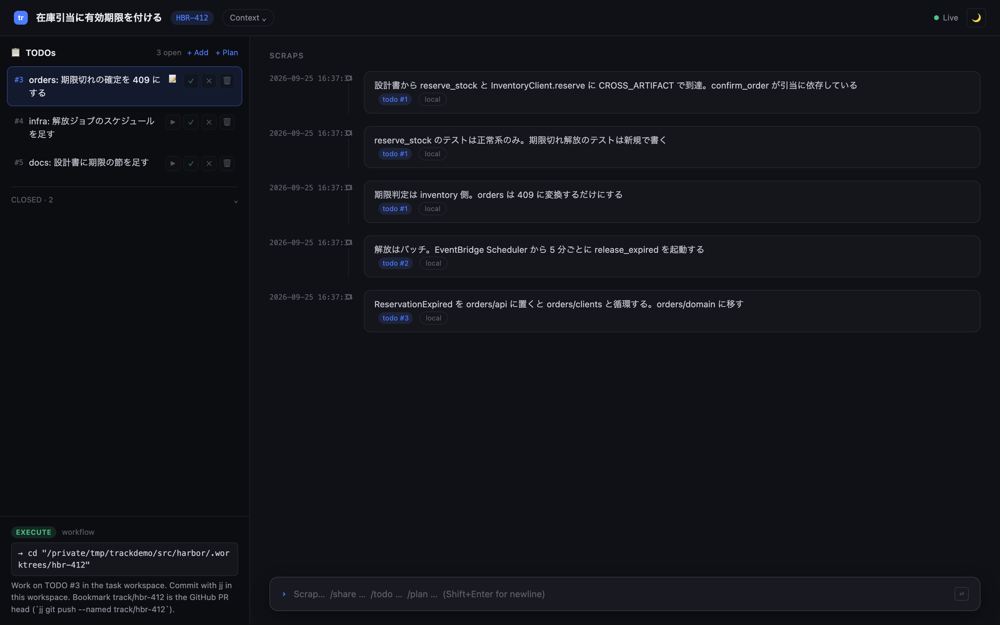

`track` と `dagayn` を連携させて、1つの開発ワークフローとして動くようにした。今回はその話を書く。

dagaynについては単体で2本書いた（[グラフの話](/blog/2026/dagayn-knowledge-graph-for-code-review/)、[SQLiteの話](/blog/2026/dagayn-python-speedups-and-rust-core/)）。trackは [ドキュメント](/projects/track/) を置いてある。

## 課題

解きたいのは次の課題である。

> 並列で動くAIエージェントに、正しい場所で、正しい文脈を持って作業させ、あとから追える形で残したい。

エージェントを1つだけ動かすなら、人が横で見ていればなんとかなる。並列で動かすと、それが難しくなる。この課題は、次の4つの子課題に分けられる。

| # | 子課題 | 起きがちなこと |
| --- | --- | --- |
| 1 | 何をやるかが散らばる | チケット、TODO、判断理由が別々の場所にある |
| 2 | どこで書くかが定まらない | メインのチェックアウトで書き始める。ブランチ名とPR headがずれる |
| 3 | 作業場所の文脈が正しくない | worktreeにグラフが付いてこず、メインの古いグラフを読む |
| 4 | 影響範囲が見えない | caller、テスト、設計書、サービス境界の向こう側を見落とす |

## trackとdagaynがどう解くか

子課題1と2はtrackが、4はdagaynが解く。3は、2つを連携させて初めて解ける。

| # | 担当 | 解き方 |
| --- | --- | --- |
| 1 | track | タスクにTODO、チケット、メモ（スクラップ）を束ねる |
| 2 | track | タスクごとに `.worktrees/<slug>` と `track/<slug>` を作り、移動先を返す |
| 3 | 連携 | trackが作った作業場所に、dagaynのグラフが付いていく |
| 4 | dagayn | caller、テスト、設計書との対応をグラフから返す |

```diagram-design devflow-overview
```

子課題3は、どちらか単体では解けない。trackは作業場所を作れるが、グラフのことは知らない。dagaynはグラフを持てるが、どのタスクのどの作業場所にいるかは知らない。

そこでdagaynに、trackが作る作業場所へ追従する仕組みを入れた。

- `dagayn worktree sync` で、メインのグラフを作業場所にコピーし、差分だけ再パースする
- trackが `vcs-mode=jj` で作るjjワークスペースを、gitのlinked worktreeとして扱う
- グラフが使える状態かどうかを、作業場所ごとに判定する
- trackが返す `workspace_path` を、dagaynのMCPツールの `repo_root` として渡す

これで、作業場所が何個あっても、それぞれが自分の場所のグラフを読めるようになる。

## 例repoで見るワークフロー

ここからは、架空のモノレポ `harbor` でチケット1枚を最後まで追う。各段階の見出しに、どの子課題を解いているかを添えた。コマンドの出力やツールの応答は、説明用に短くしたイメージである。

### harborの構成

小売向けの注文・在庫システムという設定にした。

```text
harbor/
├── apps/web/            # TypeScript 店舗向け画面
├── packages/domain/     # TypeScript 共有型
├── services/orders/     # Python 注文 API
│   └── orders/{api,clients,domain}/
├── services/inventory/  # Rust 在庫と引当
├── infra/terraform/     # Terraform
└── docs/design/         # 設計書
```

ordersからinventoryへの呼び出しはHTTP越しなので、コードのグラフには出てこない。そこを設計書で補う。

```markdown
<!-- constrained-by ../adr/0007-stock-consistency.md -->
# 在庫引当

## 引当の作成

注文 API は `InventoryClient.reserve` で在庫サービスの `reserve_stock` を呼ぶ。
```

dagaynは設計書のコードスパンをシンボルに照合して、`CROSS_ARTIFACT` エッジを張る。これで、PythonとRustは設計書を介してつながる。

```diagram-design harbor-monorepo
```

### チケット

> **HBR-412** 在庫引当に有効期限を付ける
>
> 決済離脱で引当が残り続けている。期限を持たせて定期的に解放したい。期限切れの引当で確定しようとしたら409を返す。

### 1. タスクを作る（子課題1、2）

```bash
cd ~/src/harbor
jj git fetch
track new "在庫引当に有効期限を付ける" --ticket HBR-412
track repo add . --base main@origin

track todo add "既存の引当フローと設計書を読む" --no-workspace
track todo add "inventory: 引当に期限を持たせ、期限切れを解放する"
track todo add "orders: 期限切れの確定を 409 にする"
track todo add "infra: 解放ジョブのスケジュールを足す"
track todo add "docs: 設計書に期限の節を足す"
```

slugは `hbr-412` になり、`.worktrees/hbr-412/` とbookmark `track/hbr-412` が決まる。TODOは「レビューできる1ステップ」くらいで切る。調べものだけのTODOには `--no-workspace` を付ける。

`--base main@origin` は付けておく。付けないとメインの作業コピーが土台になり、説明の無い空コミットが1つ挟まって、`jj git push` に断られる。

移動先は、trackが返す。

```json
{
  "workflow": { "phase": "execute" },
  "hint": { "next_command": "cd \"/src/harbor/.worktrees/hbr-412\"" },
  "jj": { "workspace_path": "/src/harbor/.worktrees/hbr-412" }
}
```

エージェントには「ディレクトリは推測せず、`hint.next_command` に従う」とだけ伝えればよい。

### 2. ワークスペースに入る（子課題3）

```bash
cd ~/src/harbor/.worktrees/hbr-412
dagayn worktree sync
```

```text
seeded graph from ~/src/harbor
incremental update: 0 files re-parsed
sync: commit_synced
```

メインのグラフを引き継ぎ、差分だけを追いつかせる。フルビルドはしないので、数秒で使える状態になる。

グラフの状態は、dagaynが次のように判定する。hook、MCP、`dagayn status` は同じ判定を使う。

| 状態 | 意味 | 分析 |
| --- | --- | --- |
| `unbuilt` | グラフが空 | 不可 |
| `commit_drift` | 記録コミットとHEADがずれている | 不可 |
| `commit_synced` | HEADもファイルも一致 | 可 |
| `worktree_behind` | 未反映の編集がある | 可（追いつかせる） |
| `worktree_ahead` | 編集は反映済み | 可 |

MCPのツール呼び出しには `repo_root` を渡せる。trackが返す `jj.workspace_path` をそのまま渡せば、MCPサーバをどこで起動していても、このワークスペースのグラフを読める。

### 3. 調べる（子課題4）

エージェントに渡すのは「HBR-412のTODO 1をやって」くらいである。あとはエージェントがtrackとグラフに聞いていく。

```text
query_graph_tool(pattern="implementations_of", target="docs/design/inventory-reservation.md",
                 repo_root="/src/harbor/.worktrees/hbr-412")
  → inventory::reserve_stock, inventory::Reservation, InventoryClient.reserve
query_graph_tool(pattern="callers_of", target="InventoryClient.reserve")
  → create_order, confirm_order
query_graph_tool(pattern="tests_for", target="reserve_stock")
  → reserves_available_stock（正常系のみ）
```

設計書からRustとPythonの両方にたどり着き、`confirm_order` が引当に依存していることが分かる。`reserve_stock` には正常系のテストしか無い。ここまでソースは開いていない。

分かったことと判断は、スクラップに残す（子課題1）。

```bash
track scrap add "期限判定は inventory 側。orders は 409 に変換するだけにする"
track todo done 1
```

### 4. 実装する（子課題1、3）

TODOごとに、編集、検査、コミットを繰り返す。

```diagram-design devflow-todo-loop
```

```bash
cargo test --manifest-path services/inventory/Cargo.toml
jj commit -m "feat(inventory): expire stock reservations"
track todo done 2
```

保存のたびにhookが `dagayn update --skip-flows` を走らせ、グラフは作業場所の編集に追いつく。

検査はワークスペースで直接叩く。jjワークスペースには `.git` が無く、`pre-commit` などがメインを見に行くことがあるためである。

### 5. レビューする（子課題4）

orders側を直したあと、コミットの前に `review_tool(mode="changes")` でレビューする。

```json
{
  "risk": "high",
  "architecture_risks": [
    { "kind": "adp_violation", "cycle": ["orders/api", "orders/clients"] }
  ]
}
```

エラー型をHTTP層に置き、クライアントからimportしたせいで、循環ができている。テストは通るので、テストだけでは気付きにくい。

エラー型を `orders/domain` に移し、もう一度レビューして循環が消えたのを確かめてからコミットする。

```bash
jj commit -m "feat(orders): reject confirmation of expired reservations"
track todo done 3
```

ここまでの状態は、`track webui` でブラウザから見られる。

```bash
track webui --open
```



左のTODOは完了した2件が畳まれ、いま作業中の `#3` が先頭に来ている。右のスクラップには、どのTODOで書いたメモかが付く。左下には `workflow.phase` と次の移動先が出ていて、エージェントが読む `hint` と同じ内容である。

画面はSSEで更新される。エージェントがCLIで `track scrap add` や `track todo done` を叩くと、開いているブラウザにもすぐ反映される。人はブラウザで進み具合を眺め、エージェントはCLIとJSONで同じタスクを読み書きする、という分担になる。

スクリーンショットは、この記事用に用意したデモ環境で撮ったものである。

### 6. インフラと設計書（子課題4）

Terraformでは解放ジョブのスケジュールを足す。

```hcl
resource "aws_scheduler_schedule" "release_expired_reservations" {
  schedule_expression = "rate(5 minutes)"
  # target は inventory のジョブ用タスク定義
}
```

設計書には期限の節を足し、ここにもコードスパンを書く。

```markdown
## 期限

`Reservation` は `expires_at` を持つ。期限切れの引当は
`aws_scheduler_schedule.release_expired_reservations` が起動する `release_expired` が解放する。
```

次に誰かが `release_expired` を触ったとき、`docs_for` でこの節が出てくる。設計書を書くことが、そのままグラフの辺を増やすことになる。

### 7. PRにする（子課題1、2）

TODOが全部閉じると、コミット列はTODOリストとほぼ同じ並びになる。

```text
○  docs(inventory): document reservation expiry
○  feat(infra): schedule expired reservation release
○  feat(orders): reject confirmation of expired reservations
○  feat(inventory): expire stock reservations
◆  main@origin
```

```bash
jj git push -b track/hbr-412 --allow-new
gh pr create --head track/hbr-412 --base main --draft
```

PR headは `track/hbr-412` に揃っている。PR本文は `track scrap list` を読み返せば、材料がだいたい揃う。

### 8. 割り込みが来たとき（子課題2、3）

途中でhotfixが来たら、別のタスクを作る。

```bash
track new "店舗画面の在庫表示が負数になる" --ticket HBR-418
track repo add . --base main@origin
```

`.worktrees/hbr-418/` が別に作られ、グラフも別になる。HBR-412の編集は、HBR-418のグラフには混ざらない。終わったら `track switch t:HBR-412` で戻る。戻り先はtrackが教えてくれる。

### 9. 片付ける

マージされたら `track archive` でワークスペースを消し、メインで `jj git fetch` する。

## リポジトリが分かれている場合

trackはタスクに複数のリポジトリを登録でき、それぞれに同じslugのワークスペースを作る。dagaynは `dagayn register` したリポジトリを横断検索できる。

ただ、`callers_of` のような辺はリポジトリの中で閉じている。グラフで追える範囲は、モノレポの方が広い。

## まだ弱いところ

- サービス間の呼び出しは、設計書のコードスパン頼みになっている
- `.git` の無いjjワークスペースと相性の悪い検査ツールがある

このあたりは今後の課題である。

## まとめ

- 課題を「何を」「どこで」「正しい文脈で」「影響範囲」の4つに分けた
- 1と2はtrack、4はdagaynが解く
- 3は、trackが作る作業場所にdagaynのグラフを追従させることで解いた
- その結果、エージェントへの指示は「HBR-412をやって」程度まで短くできる。どこで書くか、何を読むか、いつ記録するかは、道具の側が持っている
