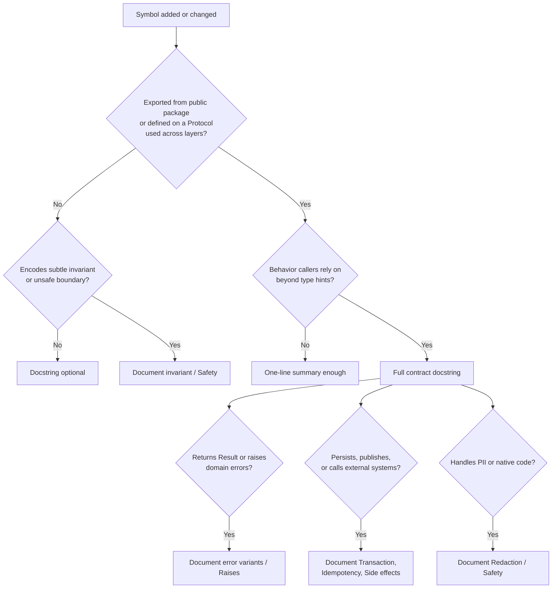

> **いつ読むか:** 公開ドメイン API、リポジトリプロトコル、遷移関数、DTO 変換、イベントスキーマ、安全なラッパーを文書化するときに読む。
> **関連:** [`domain-modeling.md`](/docs/kamae-py/domain-modeling/)、[`state-transitions.md`](/docs/kamae-py/state-transitions/)、[`unsafe-boundaries.md`](/docs/kamae-py/unsafe-boundaries/)、[`persistence-events.md`](/docs/kamae-py/persistence-events/)。

## ナレーションではなくドメイン契約を文書化する

公開ドメイン API は、呼び出し側が依存してよいものを説明すべきである。不変条件、構築経路、状態遷移、エラー、副作用、トランザクション期待、冪等性、マスキング、安全でない/ネイティブ境界契約を含む。

プライベートヘルパーは、微妙な不変条件をエンコードしていない限り、通常 docstring は不要である。

## docstring 形式の規約

**推奨:** Kamae Python のドメインおよびアプリケーションコードには **Google スタイル** docstring を使う。

| スタイル | Kamae Python で使う? | 備考 |
| --- | --- | --- |
| **Google** | **優先** | ソースと IDE ツールチップで読みやすい。Sphinx（`sphinx.ext.napoleon`）、pydoc、多くのリンターと相性が良い |
| NumPy | 数値/科学モジュールでは許容 | パラメータブロックが重い。pandas 多用コードでは可 |
| reStructuredText | 新規ドメインコードでは避ける | Sphinx 専用ドキュメントツリーで一般的。アプリケーションリポジトリではノイズになりやすい |

規約:

- 1 行目: 命令形の要約（`Move a waiting request to en-route…`）。`Moves…` や `This function…` ではない。
- 契約情報を運ぶときだけ `Args`、`Returns`、`Raises`、および任意の `Side effects`、`Transaction`、`Idempotency`、`Redaction`、`Safety` セクションを使う。
- 型ヒントが型の真実の源。単位、範囲、判別バリアントを明確にするときだけ docstring で繰り返す。
- Ruff フォーマットに合わせ、行は ≤ 88–100 文字に保つ。

```python
def assign_driver(waiting: Waiting, driver_id: UUID, now: datetime) -> EnRoute:
    """Move a waiting request to en-route after caller has authorized assignment.

    Args:
        waiting: Current aggregate state; must have ``kind == "waiting"``.
        driver_id: Driver accepting the trip.
        now: Assignment timestamp supplied by the caller (not read from a clock here).

    Returns:
        New ``EnRoute`` state. Does not persist or publish events.

    Raises:
        ValueError: If ``waiting.kind`` is not ``"waiting"``.

    Transaction:
        Caller must save the returned state and a matching ``DriverAssigned`` event
        in one repository transaction.
    """
```

## 公開 API をいつ文書化するか

新規または変更されたシンボルには次の決定フローを使う:



**チェックリスト対応（9.1、9.5）:** 公開ドメイン型、コンストラクタ、遷移、リポジトリプロトコル、DTO マッパー、ネイティブラッパーには契約が必要。プライベートヘルパーと使い捨てスクリプトには不要。検証を迂回したり PII を漏らす誤用が起きうる場合を除く。

## 文書化する内容

ドメインまたはアダプター契約の一部であるとき、次の公開項目を文書化する:

- 値オブジェクト: 意味、検証ルール、単位、範囲、プライバシー/マスキング期待。
- コンストラクタとパーサー: 受け入れる入力、拒否する入力、エラーバリアント。
- 状態モデルと判別共用体: 有効なライフサイクル状態と各バリアントがいつ生成されるか。
- 遷移関数: ソース状態、ターゲット状態、前提条件、発行イベント、失敗モード。
- リポジトリプロトコル: トランザクション境界、一貫性保証、楽観的ロック、冪等性、エラーマッピング。
- DTO と行変換関数: 外部形状の仮定と検証境界。
- ネイティブラッパー: 安全 API 保証と呼び出し側の義務。

関数名を繰り返すだけの docstring は避ける。

## TypeAdapter とパーサーの docstring

モジュールレベルのアダプターは境界契約の一部である。何を受け入れ、何を拒否し、誰が `ValidationError` を捕捉するかを文書化する。

```python
from pydantic import TypeAdapter

CreateRequestInputAdapter = TypeAdapter(CreateRequestInput)
"""Validate inbound HTTP/queue payloads into ``CreateRequestInput``.

Accepted shape:
    JSON object with ``passenger_id`` (UUID), ``pickup_lat`` / ``pickup_lng`` (float).

Rejected:
    Unknown fields (``extra="forbid"``), coerced types (``strict=True``), out-of-range
    coordinates.

Raises:
    ``ValidationError``: Caller (controller or consumer) maps to 422 / DLQ.

Does not:
    Check tenant ownership or business rules—use ``create_request_use_case`` after parse.
"""


def parse_create_request_input(raw: object) -> CreateRequestInput:
    """Parse ``raw`` through ``CreateRequestInputAdapter``."""
    return CreateRequestInputAdapter.validate_python(raw)
```

叙述はアダプター定数またはパース関数のどちらか一方に置く。重複テキストを両方に書かない。

## イベントスキーマの docstring

イベントモデルは長寿命の契約である。クラス上でバージョニング、ペイロード意味、PII 期待を文書化する。

```python
class DriverAssigned(DomainModel):
    """Emitted when a driver is assigned to a waiting request.

    Event contract:
        ``event_name``: ``driver_assigned``
        ``event_version``: ``1`` (see persistence-events.md for v2 migration)

    Payload:
        ``driver_id``, ``passenger_id``: Tier D identifiers—OK in structured logs,
        not in client-visible errors. See pii-protection.md.

    Consumers:
        Must dedupe by ``event_id``. At-least-once delivery is expected from outbox relay.

    Schema changes:
        Add fields only in a new ``event_version``; do not rename without an upcaster.
    """

    event_name: Literal["driver_assigned"] = "driver_assigned"
    event_version: Literal[1] = 1
    event_id: UUID
    event_at: datetime
    aggregate_id: UUID
    driver_id: UUID
    passenger_id: UUID
```

判別イベント共用体の場合は、共用体エイリアスまたはモジュール docstring に判別子とバリアントの全集合を文書化する。

## 有用なときは構造化セクションを使う

`Raises`、`Returns`、`Side effects`、`Transaction`、`Idempotency`、`Redaction`、`Safety` のような短い見出しは、具体的な契約価値を追加するときだけ使う。空の定型セクションは追加しない。

Result 値を返す関数では、呼び出し側が処理すべきエラーバリアントを説明する。フレームワークまたは Pydantic 例外を投げうる関数では、どのレイヤーが捕捉するかを述べる。

```python
async def assign_driver_use_case(...) -> Result[EnRoute, AssignDriverError]:
    """Assign a driver to a waiting request and persist the transition.

    Returns:
        ``Ok(EnRoute)`` on success.

    Errors:
        ``RequestNotFound``: Unknown ID or cross-tenant access (same outward code).
        ``InvalidState``: Aggregate not in ``waiting``.
        ``ConcurrentModification``: Optimistic lock conflict; safe to retry read.
        ``DriverNotAvailable``: Driver failed eligibility check.

    Transaction:
        Opens one transaction in ``RequestStore.save_en_route``; rolls back on any error.

    Idempotency:
        ``idempotency_key`` dedupes duplicate HTTP retries at the repository layer.
    """
```

## リポジトリプロトコルの文書化

```python
class RequestStore(Protocol):
    async def save_en_route(
        self,
        state: EnRoute,
        events: tuple[DriverAssigned, ...],
        *,
        expected_version: int,
        idempotency_key: str,
    ) -> None:
        """Persist ``state`` and outbox rows atomically.

        Preconditions:
            ``state.kind == "en_route"``. ``events`` must include one ``DriverAssigned``
            for this transition.

        Concurrency:
            Raises ``VersionConflict`` when ``expected_version`` does not match the row.

        Idempotency:
            Duplicate ``idempotency_key`` returns without double-writing.

        Side effects:
            Inserts outbox records; does not publish to the broker.
        """
        ...
```

## 例

例は安全な構築経路を示すべきであり、生フィールドのショートカットではない。合成 ID と偽の個人データを使う。実際のシークレット、トークン、メール、顧客 ID、本番ペイロード、プライベート URL をドキュメントに含めない。

```python
>>> from uuid import UUID
>>> from datetime import datetime, timezone
>>> waiting = Waiting(
...     request_id=UUID("00000000-0000-4000-8000-000000000001"),
...     tenant_id=UUID("00000000-0000-4000-8000-000000000099"),
...     passenger_id=UUID("00000000-0000-4000-8000-000000000002"),
...     created_at=datetime(2026, 1, 1, tzinfo=timezone.utc),
...     version=1,
... )
>>> en_route = assign_driver(
...     waiting,
...     driver_id=UUID("00000000-0000-4000-8000-000000000003"),
...     now=datetime(2026, 1, 1, 0, 5, tzinfo=timezone.utc),
... )
>>> en_route.kind
'en_route'
```

型が `repr`、ログ、シリアライズをマスキングするときは、それを公開契約の一部として述べる。

## ドキュメントを正確に保つ

**チェックリスト対応（9.3、9.4）:** 例は外部入力に `model_construct` を使ったり、DTO 変換を迂回したり、不可能な遷移を示してはならない。

ドリフトを検出する実践:

- リポジトリがサポートするとき、重要な例で doctest またはスニペットテストを実行する。
- 公開 docstring 契約の破壊的変更は、レビューで API 変更と同様に扱う。
- イベントと DTO のドキュメントでは方針本文をコピーせず、[`persistence-events.md`](/docs/kamae-py/persistence-events/) と [`boundary-defense.md`](/docs/kamae-py/boundary-defense/) へリンクする。

## レビュー観点

### エラー、例外、ネイティブ契約は文書化されているか — High

呼び出し元が扱うべき重要バリアントを隠すドメインエラーまたは Result を返す公開関数を指摘する。どの層がキャッチするか書いていない本番例外を指摘する。

ネイティブラッパーは安全 API 保証と呼び出し元の義務を文書化する。

### 例は安全な経路を示しているか — Medium

`model_construct` で不変条件を持つ値を組み立て、DTO 変換を迂回し、説明なくバリデーションエラーを無視し、PII を漏らし、不可能な状態遷移を示す例を指摘する。

リポジトリが doctest やスニペットテストを使うなら、それで動く例を優先する。

### 公開ドメイン API は契約を文書化しているか — Medium

不変条件、有効入力、単位、ライフサイクルルール、副作用、一貫性保証を docstring に書いていない公開ドメイン型、コンストラクタ、状態モデル、遷移関数、リポジトリプロトコル、DTO 変換、アダプターラッパーを指摘する。

レビュアーや保守者が誤用しそうな微妙な不変条件をエンコードする非公開ヘルパー以外に docstring を要求しない。

### docstring と例は保守されているか — Low

古い型名、もはや動かない例、現在のコンストラクタ/エラー/状態挙動と矛盾する文書を指摘する。

古い文書がバリデーション迂回、エラーバリアントの誤処理、ネイティブ誤用、機微データ漏洩を招きうる場合はエスカレートする。

### 文書チェックのスコープは適切か — Low

壊れた例や API ドリフトを検知する手段がない公開ライブラリパッケージを指摘する。

プロジェクトが既にその方針を持っていない限り、アプリケーションコードのすべての非公開ヘルパーに docstring を要求しない。生成コード周りの安全ラッパーには契約文書が必要。
