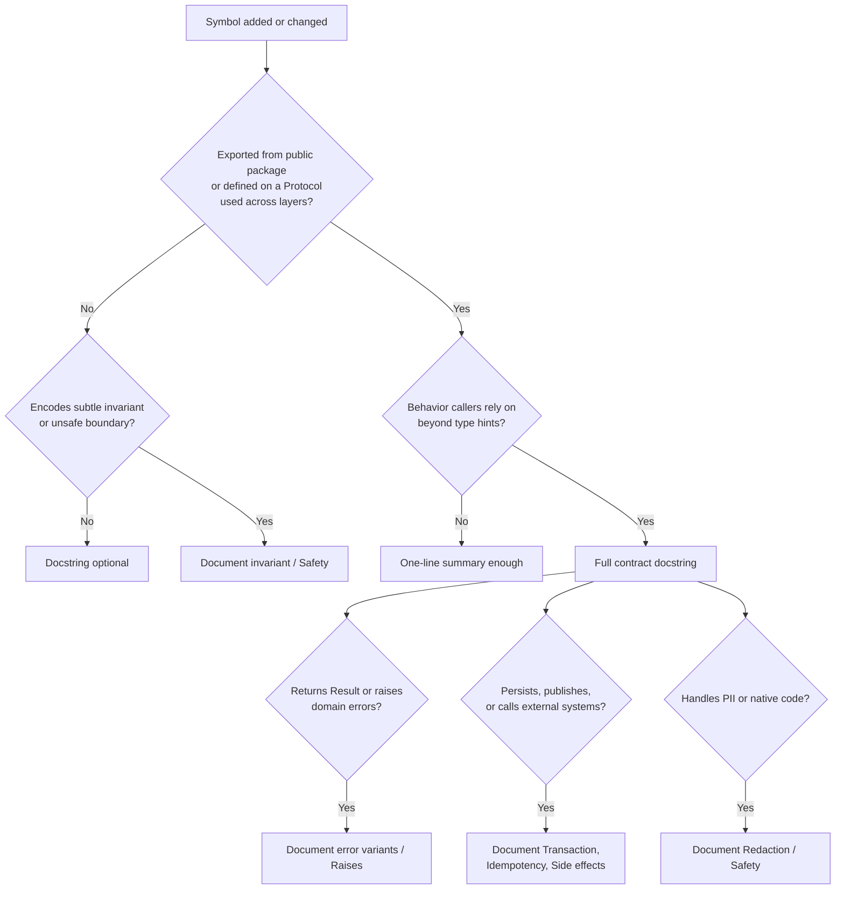

> **When to read:** Documenting public domain APIs, repository protocols, transition functions, DTO conversion, event schemas, or safe wrappers.
> **Related:** [`domain-modeling.md`](/docs/kamae-py/references/domain-modeling/), [`state-transitions.md`](/docs/kamae-py/references/state-transitions/), [`unsafe-boundaries.md`](/docs/kamae-py/references/unsafe-boundaries/), [`persistence-events.md`](/docs/kamae-py/references/persistence-events/).


## Document Domain Contracts, Not Narration

Public domain APIs should explain what callers may rely on: invariants, construction paths, state transitions, errors, side effects, transaction expectations, idempotency, redaction, and unsafe/native boundary contracts.

Private helpers usually do not need docstrings unless they encode a subtle invariant.

## Docstring Format Convention

**Recommendation:** Use **Google-style** docstrings for Kamae Python domain and application code.

| Style | Use in Kamae Python? | Notes |
| --- | --- | --- |
| **Google** | **Preferred** | Readable in source and IDE tooltips; works with Sphinx (`sphinx.ext.napoleon`), pydoc, and many linters |
| NumPy | Acceptable for numeric/scientific modules | Heavier parameter blocks; fine for pandas-heavy code |
| reStructuredText | Avoid for new domain code | Common in Sphinx-only doc trees; noisy in application repos |

Conventions:

- First line: imperative summary (`Move a waiting request to en-route…`), not `Moves…` or `This function…`.
- Use `Args`, `Returns`, `Raises`, and optional `Side effects`, `Transaction`, `Idempotency`, `Redaction`, `Safety` sections only when they carry contract information.
- Type hints are the source of truth for types; repeat them in docstrings only when clarifying units, ranges, or discriminated variants.
- Keep lines ≤ 88–100 characters to match Ruff formatting.

```python
def assign_driver(waiting: Waiting, driver_id: UUID, now: datetime) -> EnRoute:
    """Move a waiting request to en-route after caller has authorized assignment.

    Args:
        waiting: Current aggregate state; must have ``kind == "waiting"``.
        driver_id: Driver accepting the trip.
        now: Assignment timestamp supplied by the caller (not read from a clock here).

    Returns:
        New ``EnRoute`` state. Does not persist or publish events.

    Raises:
        ValueError: If ``waiting.kind`` is not ``"waiting"``.

    Transaction:
        Caller must save the returned state and a matching ``DriverAssigned`` event
        in one repository transaction.
    """
```

## When to Document Public APIs

Use this decision flow for new or changed symbols:



**Checklist mapping (9.1, 9.5):** Public domain types, constructors, transitions, repository protocols, DTO mappers, and native wrappers need contracts. Private helpers and one-off scripts do not—unless misuse would bypass validation or leak PII.

## What to Document

Document these public items when they are part of a domain or adapter contract:

- Value objects: meaning, validation rules, units, ranges, privacy/redaction expectations.
- Constructors and parsers: accepted inputs, rejected inputs, and error variants.
- State models and discriminated unions: valid lifecycle states and when each variant is produced.
- Transition functions: source state, target state, preconditions, emitted events, and failure modes.
- Repository protocols: transaction boundaries, consistency guarantees, optimistic locking, idempotency, and error mapping.
- DTO and row conversion functions: external shape assumptions and validation boundaries.
- Native wrappers: safe API guarantees and caller obligations.

Avoid docstrings that merely repeat the function name.

## TypeAdapter and Parser Docstrings

Module-level adapters are part of the boundary contract. Document what they accept, what they reject, and who catches `ValidationError`.

```python
from pydantic import TypeAdapter

CreateRequestInputAdapter = TypeAdapter(CreateRequestInput)
"""Validate inbound HTTP/queue payloads into ``CreateRequestInput``.

Accepted shape:
    JSON object with ``passenger_id`` (UUID), ``pickup_lat`` / ``pickup_lng`` (float).

Rejected:
    Unknown fields (``extra="forbid"``), coerced types (``strict=True``), out-of-range
    coordinates.

Raises:
    ``ValidationError``: Caller (controller or consumer) maps to 422 / DLQ.

Does not:
    Check tenant ownership or business rules—use ``create_request_use_case`` after parse.
"""


def parse_create_request_input(raw: object) -> CreateRequestInput:
    """Parse ``raw`` through ``CreateRequestInputAdapter``."""
    return CreateRequestInputAdapter.validate_python(raw)
```

Place the narrative on the adapter constant or on the parse function—not both with duplicate text.

## Event Schema Docstrings

Event models are long-lived contracts. Document versioning, payload semantics, and PII expectations on the class.

```python
class DriverAssigned(DomainModel):
    """Emitted when a driver is assigned to a waiting request.

    Event contract:
        ``event_name``: ``driver_assigned``
        ``event_version``: ``1`` (see persistence-events.md for v2 migration)

    Payload:
        ``driver_id``, ``passenger_id``: Tier D identifiers—OK in structured logs,
        not in client-visible errors. See loggable-identifiers.md.

    Consumers:
        Must dedupe by ``event_id``. At-least-once delivery is expected from outbox relay.

    Schema changes:
        Add fields only in a new ``event_version``; do not rename without an upcaster.
    """

    event_name: Literal["driver_assigned"] = "driver_assigned"
    event_version: Literal[1] = 1
    event_id: UUID
    event_at: datetime
    aggregate_id: UUID
    driver_id: UUID
    passenger_id: UUID
```

For discriminated event unions, document the discriminator and the full set of variants on the union alias or module docstring.

## Use Structured Sections When Useful

Use short headings such as `Raises`, `Returns`, `Side effects`, `Transaction`, `Idempotency`, `Redaction`, or `Safety` only when they add concrete contract value. Do not add empty boilerplate sections.

For functions returning Result values, describe the error variants callers must handle. For functions that can raise framework or Pydantic exceptions, state which layer catches them.

```python
async def assign_driver_use_case(...) -> Result[EnRoute, AssignDriverError]:
    """Assign a driver to a waiting request and persist the transition.

    Returns:
        ``Ok(EnRoute)`` on success.

    Errors:
        ``RequestNotFound``: Unknown ID or cross-tenant access (same outward code).
        ``InvalidState``: Aggregate not in ``waiting``.
        ``ConcurrentModification``: Optimistic lock conflict; safe to retry read.
        ``DriverNotAvailable``: Driver failed eligibility check.

    Transaction:
        Opens one transaction in ``RequestStore.save_en_route``; rolls back on any error.

    Idempotency:
        ``idempotency_key`` dedupes duplicate HTTP retries at the repository layer.
    """
```

## Repository Protocol Documentation

```python
class RequestStore(Protocol):
    async def save_en_route(
        self,
        state: EnRoute,
        events: tuple[DriverAssigned, ...],
        *,
        expected_version: int,
        idempotency_key: str,
    ) -> None:
        """Persist ``state`` and outbox rows atomically.

        Preconditions:
            ``state.kind == "en_route"``. ``events`` must include one ``DriverAssigned``
            for this transition.

        Concurrency:
            Raises ``VersionConflict`` when ``expected_version`` does not match the row.

        Idempotency:
            Duplicate ``idempotency_key`` returns without double-writing.

        Side effects:
            Inserts outbox records; does not publish to the broker.
        """
        ...
```

## Examples

Examples should demonstrate the safe construction path, not raw-field shortcuts. Use synthetic IDs and fake personal data. Never include real secrets, tokens, emails, customer IDs, production payloads, or private URLs in docs.

```python
>>> from uuid import UUID
>>> from datetime import datetime, timezone
>>> waiting = Waiting(
...     request_id=UUID("00000000-0000-4000-8000-000000000001"),
...     tenant_id=UUID("00000000-0000-4000-8000-000000000099"),
...     passenger_id=UUID("00000000-0000-4000-8000-000000000002"),
...     created_at=datetime(2026, 1, 1, tzinfo=timezone.utc),
...     version=1,
... )
>>> en_route = assign_driver(
...     waiting,
...     driver_id=UUID("00000000-0000-4000-8000-000000000003"),
...     now=datetime(2026, 1, 1, 0, 5, tzinfo=timezone.utc),
... )
>>> en_route.kind
'en_route'
```

When a type redacts `repr`, logs, or serialization, mention that as part of the public contract.

## Keeping Docs Accurate

**Checklist mapping (9.3, 9.4):** Examples must not use `model_construct` on external input, bypass DTO conversion, or show impossible transitions.

Practices that catch drift:

- Run doctest or snippet tests on critical examples when the repo supports them.
- Treat breaking changes to public docstring contracts like API changes in review.
- Link to [`persistence-events.md`](/docs/kamae-py/references/persistence-events/) and [`boundary-defense.md`](/docs/kamae-py/references/boundary-defense/) from event and DTO docs instead of copying policy prose.
