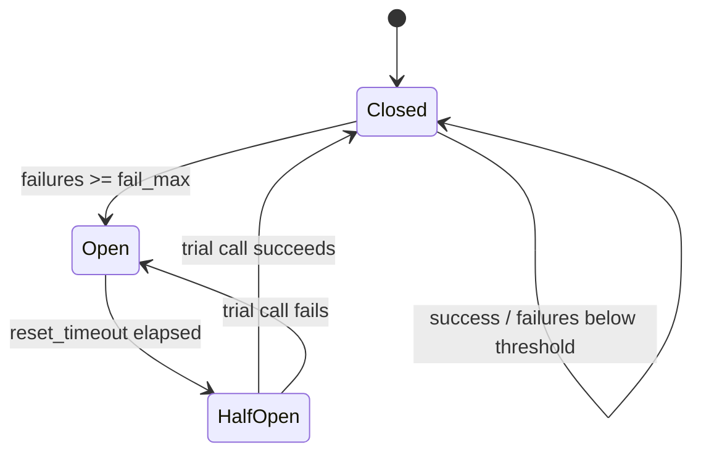

> **When to read:** Adding retry, timeout, or circuit-breaker behavior around external API, database, or queue adapters.
> **Related:** [`error-handling.md`](/docs/kamae-py/references/error-handling/), [`persistence-events.md`](/docs/kamae-py/references/persistence-events/), [`application-wiring.md`](/docs/kamae-py/references/application-wiring/).


## Keep Resilience in Infrastructure

Retry, timeout, and circuit-breaker policies belong in **infrastructure adapters**, not in domain transitions or use-case business rules.

| Concern | Layer | Representation |
| --- | --- | --- |
| "Request not found" | Application / domain | `Err(RequestNotFound(...))` |
| Transient HTTP 503 from partner API | Infrastructure | retry with backoff, then raise or map |
| DB connection timeout | Infrastructure | raise; framework or job runner may retry |
| Duplicate command on retry | Application + persistence | idempotency key (see [`persistence-events.md`](/docs/kamae-py/references/persistence-events/)) |

Domain code should not import `tenacity`, circuit-breaker libraries, or HTTP client retry middleware.

## Retry

Use [tenacity](https://github.com/jd/tenacity) or the HTTP client's built-in retry policy at the adapter boundary.

```bash
uv add tenacity
```

Retry only **transient, idempotent** operations:

- Safe GET/read calls with no side effects.
- Writes that include an idempotency key and database dedupe.
- Outbox relay publish after commit.

Do **not** blindly retry use cases that can double-charge, double-assign, or emit duplicate notifications without idempotency protection.

```python
from tenacity import retry, stop_after_attempt, wait_exponential


@retry(stop=stop_after_attempt(3), wait=wait_exponential(multiplier=0.5, max=8))
async def fetch_driver_profile(client: httpx.AsyncClient, driver_id: UUID) -> DriverProfileDto:
    response = await client.get(f"/drivers/{driver_id}", timeout=5.0)
    response.raise_for_status()
    return DriverProfileDtoAdapter.validate_python(response.json())
```

Map exhausted retries to a stable infrastructure exception or use-case error at the adapter edge. Do not leak raw `httpx` or driver exception types through the port protocol.

Read [`error-handling.md`](/docs/kamae-py/references/error-handling/) for when infrastructure failures stay exceptions vs become `Err`.

### Tenacity strategy decision table

| Scenario | `stop` | `wait` | `retry` predicate | Notes |
| --- | --- | --- | --- | --- |
| Idempotent GET / read | `stop_after_attempt(3–5)` | `wait_exponential(multiplier=0.5, max=8)` | HTTP 502/503/504, timeouts | Safe default for partner reads |
| Outbox publish | `stop_after_attempt(10)` | exponential + jitter | broker errors, timeouts | Pair with `event_id` dedupe on consumer |
| DB connect on startup | `stop_after_delay(60)` | fixed 1s | `OperationalError` | Composition root only |
| Payment / charge POST | **No blind retry** | — | — | Use idempotency key + single retry only after `409`/known safe response |
| Optimistic lock conflict | **Do not retry** in adapter | — | — | Use case re-reads and decides |
| Rate limit 429 | `stop_after_attempt(5)` | `wait_exponential` + respect `Retry-After` | 429 only | Cap total wait below SLA |

```python
from tenacity import retry, retry_if_exception_type, stop_after_attempt, wait_exponential


@retry(
    retry=retry_if_exception_type(httpx.TimeoutException),
    stop=stop_after_attempt(3),
    wait=wait_exponential(multiplier=0.5, max=8),
    reraise=True,
)
async def fetch_with_timeout(...) -> DriverProfileDto:
    ...
```

Add `before_sleep` logging with correlation IDs—not response bodies. Jitter (`wait_random_exponential`) reduces thundering herds on shared dependencies.

## Timeout

Set timeouts on every outbound call: HTTP clients, DB statements, queue polls, and SDK operations.

- Prefer per-request timeouts on the client (`timeout=...` in httpx/aiohttp).
- Keep domain and use-case functions free of `asyncio.wait_for` unless the timeout is part of the business rule (rare).
- Document SLA expectations on port protocols when callers need to know worst-case latency.

```python
async with httpx.AsyncClient(timeout=httpx.Timeout(5.0, connect=2.0)) as client:
    ...
```

## Circuit Breaker

Use a circuit breaker when a downstream dependency fails often enough that fast-failing protects the service and avoids retry storms.

Common libraries:

- `pybreaker`
- Resilience features in the service mesh or API gateway (preferred when already standardized)

Wrap **adapter implementations**, not use cases:

```python
breaker = CircuitBreaker(fail_max=5, reset_timeout=30)


async def call_partner_api(...) -> PartnerResponseDto:
    return await breaker.call_async(_do_call, ...)
```

When the breaker is open, return a stable degraded-mode error or queue the work for later. Do not represent breaker state as a domain lifecycle state.

### Circuit breaker state machine



| State | Behavior | Caller experience |
| --- | --- | --- |
| **Closed** | All calls pass through; failures counted | Normal latency or mapped errors |
| **Open** | Calls fail fast without hitting dependency | Stable `ServiceUnavailable` / queued work |
| **Half-open** | One trial call allowed | Success closes; failure reopens |

Configuration guidance:

- `fail_max`: 5–10 consecutive failures for HTTP partners; tune from error budget.
- `reset_timeout`: 30–120s; shorter for non-critical reads, longer for overloaded cores.
- Prefer mesh/gateway breakers when already deployed—they protect all callers.
- Emit metrics: `breaker_state`, `breaker_trips_total`, `breaker_rejected_calls_total`.
- Combine with tenacity **inside** the closed state only; do not nest retry loops that fight the open state.

## Interaction With Idempotency and Outbox

Retries at the infrastructure layer complement—but do not replace—application idempotency:

1. Use case checks business preconditions and builds state + events.
2. Repository persists atomically with `idempotency_key` and version checks.
3. Outbox worker retries publish with its own backoff.
4. External API adapters retry only when the operation is safe or keyed.

Test retry paths with fakes that fail N times before succeeding, and with integration tests that verify unique constraints and idempotency keys under duplicate delivery.
