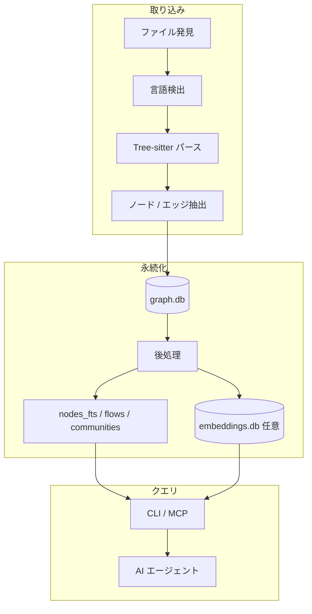

dagaynはリポジトリ内容をローカル知識グラフに変換し、CLIとMCPから同じデータセットをクエリする。中核は **Tree-sitter + SQLite** で、ホットパスは **Rust（`dagayn_core`）** が担う。

## 全体像



## 処理パイプライン（5段階）

### 1. ファイル発見と言語検出

拡張子、shebang、設定ファイルに基づいてパーサを割り当てる。拡張子なしスクリプトはshebangからBash / Python等を推定する。

対応はポリグロット：アプリコード、Markdown、Terraform、Notebookを同一リポジトリ内で混在可能。

### 2. パーサ抽出

Tree-sitterを基本とし、fork固有grammarは **commit pin** で取得する。

| 形式 | 備考 |
| --- | --- |
| Terraform | fork `tree-sitter-terraform`。`.tf` / `.tfvars` |
| Markdown | fork `tree-sitter-markdown`。directive コメント対応 |
| Notebook | セル単位。span overlap で行番号ずれに耐性 |
| Rust / Python / JS・TS 系 | Rust 所有パスが既定 |

パーサ出力は常に **ファイル単位** のノード・エッジ列。qualified nameはリポジトリ内で一意。

### 3. SQLite 永続化

`.dagayn/graph.db` に書き込む。パスはリポジトリルート相対で正規化し、symlink経由の一時パス差を吸収する。

詳細は [ストレージと SQLite](/projects/dagayn/storage/) を参照。

### 4. 後処理（postprocess）

| 処理 | 出力 | スキップ |
| --- | --- | --- |
| FTS5 索引 | `nodes_fts` | 常に実行（build 後） |
| コミュニティ | Leiden 分割 + cohesion | — |
| Centrality | `hub_scores`, `bridge_scores` | — |
| フロー | エントリ→葉の経路 | hook では `--skip-flows` |
| 埋め込み | `embeddings.db` | `--local-embedding` 時のみ |

派生データはmaterializeして保持する。リクエスト時に毎回NetworkXを組み立てない。

### 5. クエリ時分析

レビュー、semantic search、refactor提案はすべて同一GraphStoreを読む。変更検出はGit worktree状態とグラフを突き合わせる。

## GraphStore と Rust 境界

```text
┌─────────────────────────────────────┐
│  CLI / MCP / tests                  │
├─────────────────────────────────────┤
│  Python GraphStore（安定 API）       │
│  ・スキーマ・トランザクション         │
│  ・パス正規化・キャッシュ無効化       │
├─────────────────────────────────────┤
│  Rust dagayn_core（PyO3）            │
│  ・バッチ store / parse              │
│  ・Markdown artifact 解決            │
│  ・centrality / フロー JSON 永続化    │
└─────────────────────────────────────┘
```

移行方針：Rustは加速実装としてGraphStore APIの背後に置く。`dagayn._core` が無いsource checkoutは明確に失敗し、旧Pythonパーサにはフォールバックしない。

## ハイブリッド検索（概要）

`semantic_search_nodes` はFTS5とベクトル検索をRRF（k=10）で融合する。詳細は [セマンティック検索](/projects/dagayn/semantic-search/) を参照。

## マルチリポジトリ

レジストリに複数リポジトリを登録し、`cross_repo_search_tool` で横断検索できる。daemon設定はupstream `docs/DAEMON-CONFIG.md` を参照。

## エクスポート

GraphML、Mermaid C4、SVG、Cypher、Obsidian形式などへエクスポート可能。`dagayn visualize` / `generate_wiki_tool` が相当する。

## 設計上の判断

| 判断 | 理由 |
| --- | --- |
| qualified name でエッジ結合 | パーサ単純化、クロスアーティファクト、人間可読レスポンス |
| 保存時に DAG 制約なし | 循環を観測可能にする。ADP は後処理 |
| ファイル単位 replace 更新 | incremental diff より単純で速い |
| edge kind を分離 | 探索時の index selector 兼意味分類 |
| 派生テーブル materialize | MCP レイテンシを抑える |

## Rust 移行状況

探索・集計のホットパスは段階的にRustへ移行中。Python層はCLI・MCP・オーケストレーションを担う。upstream `docs/RUST-CORE-MIGRATION-WIP.md` に最新の移行表がある。

## 関連記事

- [dagaynがコードグラフをSQLiteで取り扱うためのテクニック](/blog/2026/dagayn-python-speedups-and-rust-core/)
- [すべてを有向グラフにする、俺とAI以外のやつが](/blog/2026/dagayn-knowledge-graph-for-code-review/)

## 関連ページ

- [ストレージと SQLite](/projects/dagayn/storage/)
- [構造メトリクス](/projects/dagayn/metrics/)
- [レビューと影響分析](/projects/dagayn/review-analysis/)
- [グラフモデル](/projects/dagayn/graph-model/)
- [セマンティック検索](/projects/dagayn/semantic-search/)
