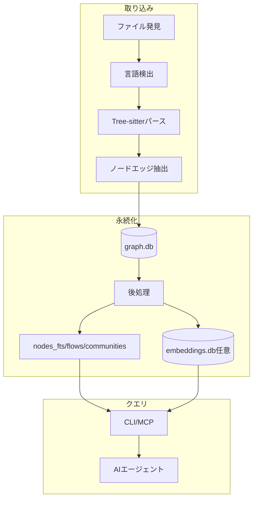

このページは、dagaynの取り込みパイプライン、SQLite永続化、Rust/Python境界を扱います。ノード種別やエッジkindの語彙は [グラフモデル](/projects/dagayn/graph-model/) へ。利用手順は [使い方](/projects/dagayn/usage/) へ。

## 全体像


```mermaid
flowchart TB
  subgraph ingest [取り込み]
    A[ファイル発見] --> B[言語検出]
    B --> C[Tree-sitterパース]
    C --> D[ノードエッジ抽出]
  end
  subgraph persist [永続化]
    D --> E[(graph.db)]
    E --> F[後処理]
    F --> G[nodes_fts/flows/communities]
    F --> H[(embeddings.db任意)]
  end
  subgraph query [クエリ]
    G --> I[CLI/MCP]
    H --> I
    I --> J[AIエージェント]
  end
```

dagaynはリポジトリ内容をローカル知識グラフに変換し、CLIとMCPから同じデータセットをクエリします。中核は **Tree-sitter + SQLite** で、ホットパスは **Rust（`dagayn_core`）** が担います。

## 処理パイプライン

### ファイル発見と言語検出

拡張子、shebang、設定ファイルに基づいてパーサを割り当てます。拡張子なしスクリプトはshebangからBash / Python等を推定します。アプリコード、Markdown、Terraform、Notebook（`.ipynb` とmarimo）を同一リポジトリ内で混在できます。

### パーサ抽出

Tree-sitterを基本とし、fork固有grammarは **commit pin** で取得します。

| 形式 | 備考 |
| --- | --- |
| Terraform | fork `tree-sitter-terraform`。`.tf` / `.tfvars` |
| Markdown | fork `tree-sitter-markdown`。directive コメント対応 |
| Notebook | セル単位。marimo `.py` / `.md`。span overlap で行番号ずれに耐性 |
| Rust / Python / JS・TS 系 | Rust 所有パスが既定 |

パーサ出力は常に **ファイル単位** のノード・エッジ列です。qualified nameはリポジトリ内で一意です。

### SQLite永続化

`.dagayn/graph.db` に書き込みます。パスはリポジトリルート相対で正規化し、symlink経由の一時パス差を吸収します。埋め込みは別ファイル `embeddings.db` に分離します。

| パス | 内容 |
| --- | --- |
| `.dagayn/graph.db` | ノード・エッジ・派生テーブル |
| `.dagayn/embeddings.db` | ベクトル埋め込み（任意） |
| `.dagayn/` 配下その他 | フローJSON、コミュニティ、Wiki生成物など |

グラフはローカル完結です。チーム共有は通常gitignoreのまま、各開発者がローカルで `dagayn build` する運用を基本とします。

### スキーマの要点

ノードは `kind`、`qualified_name`（**UNIQUE**）、`file_path`、行番号、`extra` JSONなどを持ちます。エッジは **`qualified_name` 文字列** で結びます。パーサがnode IDを知らない段階でエッジを吐け、ファイル単位の差し替え更新が単純になります。

保存時にDAG制約は入れません。import循環やdoc相互参照は現実に存在するため、ADPなどの検査は後処理で依存部分グラフに対して行います。

接続設定の例：

```sql
PRAGMA journal_mode=WAL;
PRAGMA synchronous=NORMAL;
PRAGMA cache_size=-64000;
PRAGMA mmap_size=268435456;
```

WALはhookによる頻繁な `update` とMCPクエリの並行に向きます。

### インクリメンタル更新

`dagayn update` はファイル単位のatomic replacementです。

```text
changed file
  → parse file
  → DELETE old nodes/edges for file_path
  → INSERT new nodes/edges
```

変更検出はtracked diffに加え、staged / unstaged / **untracked** も含みます。新規ファイルはステージしなくてもパース対象になります。

### 後処理

| 処理 | 出力 | スキップ |
| --- | --- | --- |
| FTS5 索引 | `nodes_fts` | 常に実行（build 後） |
| コミュニティ | Leiden 分割 + cohesion | — |
| Centrality | `hub_scores`, `bridge_scores` | — |
| フロー | エントリ→葉の経路 | hook では `--skip-flows` |
| 埋め込み | `embeddings.db` | `--local-embedding` 時のみ |

派生データはmaterializeして保持します。リクエスト時に毎回NetworkXを組み立てません。

### クエリ時分析

レビュー、semantic search、refactor提案はすべて同一GraphStoreを読みます。変更検出はGit worktree状態とグラフを突き合わせます。

## GraphStoreとRust境界

```text
┌─────────────────────────────────────┐
│  CLI / MCP / tests                  │
├─────────────────────────────────────┤
│  Native GraphStore（dagayn._core）   │
│  ・スキーマ・トランザクション         │
│  ・パーサ / FTS / フロー / コミュニティ │
│  ・パス正規化                        │
├─────────────────────────────────────┤
│  Python（残る部分）                   │
│  ・ハイブリッド検索                  │
│  ・manifest-bridge 抽出              │
│  ・analyze_changes の案内組み立て     │
└─────────────────────────────────────┘
```

`from dagayn.graph import GraphStore` はネイティブストアです。`DAGAYN_BACKEND=python` はエラーになります。`dagayn._core` が無いsource checkoutは明確に失敗し、旧Pythonエンジンにはフォールバックしません。

## グラフ探索の2方式

**Frontier batching**：BFS / DFSでnodeごとにSQLを投げるとN+1になります。frontierを層ごとにまとめ、edge kindごとの重み、token budget、応答整形が必要ならアプリ側traversalを選びます。

**Recursive CTE**：届くノード集合だけ欲しいときはSQLiteのrecursive CTEが相性良いです。impact radiusの到達集合を一括取得する用途に使います。詳細は [レビューと影響分析](/projects/dagayn/review-analysis/) を参照。

## マルチリポジトリ

レジストリに複数リポジトリを登録し、`cross_repo_search_tool` で横断検索できます。daemon設定はupstream `docs/DAEMON-CONFIG.md` を参照してください。

## エクスポート

GraphML、Mermaid C4、SVG、Cypher、Obsidian形式などへエクスポート可能です。`dagayn visualize` / `generate_wiki_tool` が相当します。

## 設計上の判断

| 判断 | 理由 |
| --- | --- |
| qualified name でエッジ結合 | パーサ単純化、クロスアーティファクト、人間可読レスポンス |
| 保存時に DAG 制約なし | 循環を観測可能にする。ADP は後処理 |
| ファイル単位 replace 更新 | incremental diff より単純で速い |
| edge kind を分離 | 探索時の index selector 兼意味分類 |
| 派生テーブル materialize | MCP レイテンシを抑える |

## ソース開発

dagayn本体のパッチ提出向け手順はupstreamリポジトリの `docs/` にあります。ローカル開発は `uv sync` と `uvx maturin develop --release` が基本です。`ARCHITECTURE.md`、`SCHEMA.md`、`COMMANDS.md` を参照してください。

## 次に読む

ノード・エッジの語彙は [グラフモデル](/projects/dagayn/graph-model/) です。差分レビューは [レビューと影響分析](/projects/dagayn/review-analysis/) へ。
