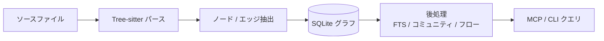

dagaynはリポジトリ内のソース、ドキュメント、インフラ定義を統一されたグラフ語彙で表現する。

## パイプライン概要

グラフはリポジトリ直下の `.dagayn/graph.db`（および関連アーティファクト）に保存される。

## 対応アーティファクト

| 種別 | 内容 |
| --- | --- |
| **ソースコード** | Python、TypeScript / JavaScript、Rust、Go、Java、C#、Ruby、PHP、Scala、Swift、Kotlin、Julia、Solidity、Dart、Lua、Bash、Elixir、Zig、PowerShell、Vue、Svelte、Astro など |
| **Markdown** | 設計書・README。directiveとコードスパンから文書間・文書→コードのエッジを抽出 |
| **Terraform** | `.tf` / `.tfvars`。block種別ごとの専用ノード |
| **Notebook** | Jupyter `.ipynb`、Databricks notebook |

ポリグロットなリポジトリ（アプリ + インフラ + 設計書）を1つのグラフに載せ、横断クエリできるのが設計上の強みである。

## ノード種別

### ソースコード

| 種別 | 意味 |
| --- | --- |
| `File` | ソースファイル |
| `Class` | クラス / 構造体など |
| `Function` | 関数 / メソッド |
| `Type` | 型定義 |
| `Test` | テスト関数 |

### Markdown

| 種別 | 意味 |
| --- | --- |
| `File` | Markdown ファイル |
| `DocSection` | 見出しセクション（`file::slug`） |
| `DocBody` | セクション配下の段落・リスト等 |

### Terraform

| block | グラフ上の種別 |
| --- | --- |
| `resource` / `data` / `module` / `provider` 等 | Class |
| `variable` / `local` / `output` | Function |
| `check` | Test |

## エッジ種別

| エッジ | 意味 |
| --- | --- |
| `CONTAINS` | 包含（ファイル→シンボル、見出し階層） |
| `CALLS` | 呼び出し |
| `IMPORTS_FROM` | import / module source |
| `INHERITS` / `IMPLEMENTS` | 継承・実装 |
| `DEPENDS_ON` | 汎用依存（directive、Terraform constraint 等） |
| `REFERENCES` | セクション間参照、Terraform 式参照 |
| `TESTED_BY` | テスト対応 |
| `CROSS_ARTIFACT` | ドキュメントのコードスパン→シンボル |

エッジ種別を分けることで、依存分析では `CALLS` を除外してノイズを抑えつつ、impact分析では呼び出し関係も含められる。

## 構造メトリクス

`dagayn build` の後処理で計算される指標。ソースを1行も読まずに「どこに手を入れるべきか」を絞り込める。

### コミュニティ・Hub・Bridge

| 指標 | 意味 |
| --- | --- |
| **Community cohesion** | Leiden分割後の凝集度。低くてサイズが大きいコミュニティは内部境界が無い塊の候補 |
| **Hub nodes** | 入次数・出次数が異常に高いノード |
| **Bridge nodes** | betweenness centralityが高いチョークポイント |

### 実行フロー（Flows）

エントリポイントから葉に向かう到達経路を事前計算する。

### ADP / SDP / SAP

Robert C. Martinのパッケージ設計原則。依存グラフの母集団は `IMPORTS_FROM` / `DEPENDS_ON` / `INHERITS` / `IMPLEMENTS`（`CALLS` は除外）。

| 原則 | 問い |
| --- | --- |
| **ADP** | パッケージ間に循環がないか |
| **SDP** | 依存は安定側へ向いているか |
| **SAP** | 安定パッケージは抽象的か |

## 関連ページ

- [Markdown / Terraform 連携](/projects/dagayn/integrations/) — 非コードアーティファクトの詳細
- [アーキテクチャ](/projects/dagayn/architecture/) — ストレージと後処理
- [MCP ツール](/projects/dagayn/mcp-tools/) — メトリクスの取得方法
