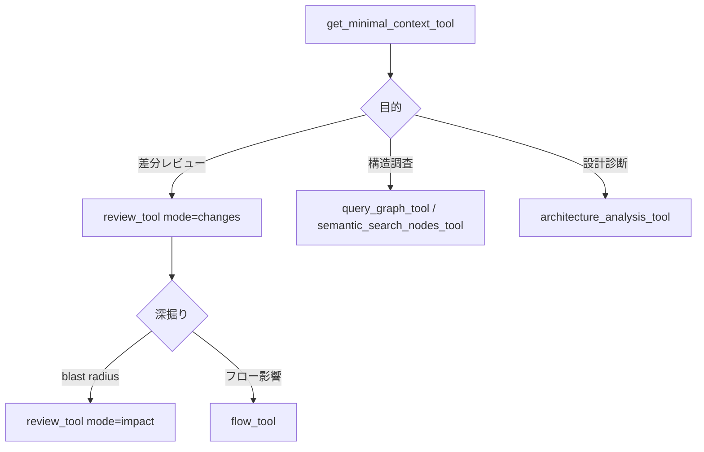

dagaynはMCPサーバとして起動し、エージェントからグラフ操作ツールを公開する。`dagayn serve` の既定はコンパクトなワークフロー面（下表の「既定」）である。`dagayn tool --list` で現在の一覧を確認できる。`all` / `full` / `*`、または `--tools` / `CRG_TOOLS` で拡張面を出す。

## レビュー・変更分析

### review_tool

変更検出・レビューコンテキスト・影響フロー・impact radiusをモード切替で取得する。

| mode | 用途 |
| --- | --- |
| `changes` | 差分起点のレビュー（まずここから） |
| `impact` | 影響範囲（blast radius）の分析 |
| `context` | レビュー用コンテキスト取得 |

```text
review_tool(mode="changes", detail_level="minimal")
```

`detail_level="minimal"` では `guidance` リストが次のアクション（テスト追加、doc更新、フロー確認等）を `claim` / `evidence` / `confidence` 形式で返す。詳細が必要なら `standard` に上げる。

### get_minimal_context_tool

タスク向けに最小限のグラフコンテキストを返す。大きなレビューの前に呼ぶとトークン消費を抑えられる。

## グラフ探索

### query_graph_tool

定義済みパターンで関係をたどる。検索ヒットのあと、ファイル全体を開き直す前に `source_of` でノードのライブ断片を取るのが推奨である（上限およそ4,000文字。`truncated` / `source_stale` を返すことがある）。

| pattern | 意味 |
| --- | --- |
| `source_of` | 1ノードの現行ワークツリー断片 |
| `callers_of` | 呼び出し元 |
| `callees_of` | 呼び出し先 |
| `imports_of` | import 関係 |
| `importers_of` | 被import（ファイルパス対象。セクション形は0件になる） |
| `tests_for` | テスト対応 |
| `docs_for` | 関連ドキュメント |
| `implementations_of` | ドキュメントからコード実装 |
| `file_summary` | ファイル概要 |

### semantic_search_nodes_tool

FTS5と埋め込みベクトルのハイブリッド検索。関数名を覚えていなくても意味的に近いシンボルを探せる。埋め込みが無い場合はFTSにフォールバックする。

### traverse_graph_tool

任意の起点からエッジ種別を指定してグラフを走査する。既定のコンパクト面には含まれない（拡張面）。

## アーキテクチャ分析

### architecture_analysis_tool

コミュニティ凝集度、hub nodes、bridge nodes、ADP / SDP / SAPメトリクスを1ショットで返す。リポジトリ初見診断の起点として使う。

### flow_tool / get_affected_flows

CLIコマンド、HTTPハンドラ、MCPツールハンドラなどのエントリポイントから葉に向かう実行フローを取得する。「この関数を変えたらどのフローが壊れるか」を調べる。

## グラフ管理

既定面では `ensure_graph_tool` がグラフの作成／更新の入口である。統計や埋め込み生成などは拡張面。

| ツール | 用途 | 面 |
| --- | --- | --- |
| `ensure_graph_tool` | グラフが無ければ build、あれば更新 | 既定 |
| `build_or_update_graph_tool` | MCP から build / update | 拡張 |
| `run_postprocess_tool` | 後処理のみ実行 | 拡張 |
| `list_graph_stats_tool` | ノード数、最終更新等 | 拡張 |
| `embed_graph_tool` | 埋め込み生成 | 拡張 |

## リファクタ・Wiki

| ツール | 用途 |
| --- | --- |
| `refactor_tool` | リファクタ候補の提案 |
| `apply_refactor_tool` | 提案の適用（要確認） |
| `find_large_functions_tool` | 大きな関数の検出 |
| `generate_wiki_tool` / `get_wiki_page_tool` | リポジトリWiki生成 |
| `get_docs_section_tool` | Markdown セクション取得 |

## マルチリポジトリ

| ツール | 用途 |
| --- | --- |
| `list_repos_tool` | 登録リポジトリ一覧 |
| `cross_repo_search_tool` | 複数リポジトリ横断検索 |

## 推奨ワークフロー


```mermaid
flowchart TD
  A[get_minimal_context_tool] --> B{目的}
  B -->|差分レビュー| C[review_tool mode=changes]
  B -->|構造調査| D[query_graph_tool / semantic_search_nodes_tool]
  B -->|設計診断| E[architecture_analysis_tool]
  C --> F{深掘り}
  F -->|blast radius| G[review_tool mode=impact]
  F -->|フロー影響| H[flow_tool]
```

## hooks との連携

`dagayn install` が登録するhookは保存後に `dagayn update --skip-flows` を走らせる。MCPツールは常に最新（またはhook更新後）のグラフを読む。グラフが空の場合は先に `ensure_graph_tool()` を実行する。並列エージェントのworktreeでは、メイン側に健全なグラフがあるなら `dagayn worktree sync` を優先する。

## 関連ページ

- [CLI リファレンス](/projects/dagayn/cli-reference/)
- [グラフモデル](/projects/dagayn/graph-model/)
- [セマンティック検索](/projects/dagayn/semantic-search/)
