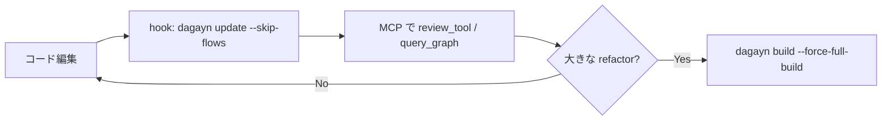

このページはdagaynを初めて使うときの最短パスである。詳細は各リファレンスページへリンクする。

## 1. インストール

[インストール](/projects/dagayn/installation/) の手順に従い、CLIとMCP登録を済ませる。

```bash
uv tool install dagayn
dagayn install --platform all --mode fts-only -y
```

## 2. グラフを構築

対象リポジトリのルートで実行する。

```bash
cd your-repo
dagayn build
dagayn status
```

初回の `build` はリポジトリ規模に比例して時間がかかる。完了後、`.dagayn/graph.db` にグラフが保存される。

## 3. 状態を確認

```bash
dagayn status
```

ノード数、最終更新時刻、埋め込みカバレッジ（有効な場合）が表示される。`complete` / `partial` / `stale` / `empty` / `not_indexed` のいずれかで鮮度が分かる。

## 4. 変更を反映

日常開発ではhookまたは手動でインクリメンタル更新する。

```bash
dagayn update
# フロー再計算を省略して高速化（hook の既定）
dagayn update --skip-flows
```

フル再構築が必要な場合：

```bash
dagayn build --force-full-build
```

## 5. MCP 経由でレビュー

AIエージェント（Cursor / Claude Code / Codex等）からMCPツールを呼ぶ。エージェントに次のような指示を出すとよい。

- 「変更の影響を `review_tool` で分析して」
- 「`FooBar` のcallerを `query_graph_tool` で調べて」
- 「`semantic_search_nodes_tool` で認証関連のシンボルを探して」

代表的なツールは [MCP ツール](/projects/dagayn/mcp-tools/) を参照。

## 6. CLI で差分レビュー

MCPを使わずCLIだけでも変更検出ができる。

```bash
dagayn detect-changes --base HEAD~1
```

tracked diffに加え、staged / unstaged / untrackedファイルもまとめて検出する。

## 典型的な日常運用



- **hook**: `dagayn install` がファイル保存時の更新を登録する。フロー再計算はコストが高いため `--skip-flows` が既定。
- **週次または大規模変更後**: `dagayn build` でフル再構築、または `dagayn update` でフロー込み更新。

## 次のステップ

| やりたいこと | ページ |
| --- | --- |
| 全CLIコマンド | [CLI リファレンス](/projects/dagayn/cli-reference/) |
| グラフの語彙 | [グラフモデル](/projects/dagayn/graph-model/) |
| 設計書をグラフに載せる | [Markdown / Terraform 連携](/projects/dagayn/integrations/) |
| 意味検索を有効化 | [セマンティック検索](/projects/dagayn/semantic-search/) |
