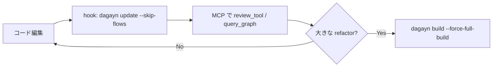

## インストール

CLIとMCP登録の詳細は [インストール](/projects/dagayn/installation/) にあります。最短ではこうです。

```bash
uv tool install dagayn
dagayn install --platform all --mode fts-only -y
```

## グラフを構築する

対象リポジトリのルートで：

```bash
cd your-repo
dagayn build
dagayn status
```

初回の `build` は規模に比例して時間がかかります。終わると `.dagayn/graph.db` に載ります。`status` ではノード数や最終更新、埋め込みがあればそのカバレッジ、鮮度（`complete` / `partial` / `stale` など）が見えます。

## 変更を反映する

日常はhookか手動のインクリメンタル更新です。

```bash
dagayn update
# フロー再計算を省略（hookの既定に近い）
dagayn update --skip-flows
```

フルでやり直したいときだけ：

```bash
dagayn build --force-full-build
```

## エージェントから見る

CursorやClaude Code、CodexなどからMCPツールを呼びます。まずIDE側でMCPが登録されているかを確認し、ツール一覧は [MCP ツール](/projects/dagayn/mcp-tools/)（または `dagayn tool --list`）で見てください。

この最短手順の `--mode fts-only` では埋め込みを作りません。最初に試すなら、変更の影響を `review_tool`、callerを `query_graph_tool` といった構造クエリが向いています。意味検索（`semantic_search_nodes_tool`）を本格的に使うときは、埋め込みモードで入れ直すか [セマンティック検索](/projects/dagayn/semantic-search/) を読んでください。fts-onlyのままだと意味検索はFTSに落ちます。

MCPなしでも差分は取れます。

```bash
dagayn detect-changes --base HEAD~1
```

trackedに加えてstaged / unstaged / untrackedもまとめて見ます。

## 日常のイメージ



hookは `dagayn install` が登録します。フロー再計算は重いので `--skip-flows` が既定寄りです。週次や大きなrefactorのあとだけ、フロー込みの `update` かフル `build` を走らせると安心です。

コマンド全般は [CLI リファレンス](/projects/dagayn/cli-reference/)、語彙は [グラフモデル](/projects/dagayn/graph-model/)、設計書を載せる話は [Markdown / Terraform 連携](/projects/dagayn/integrations/)、意味検索は [セマンティック検索](/projects/dagayn/semantic-search/) です。
