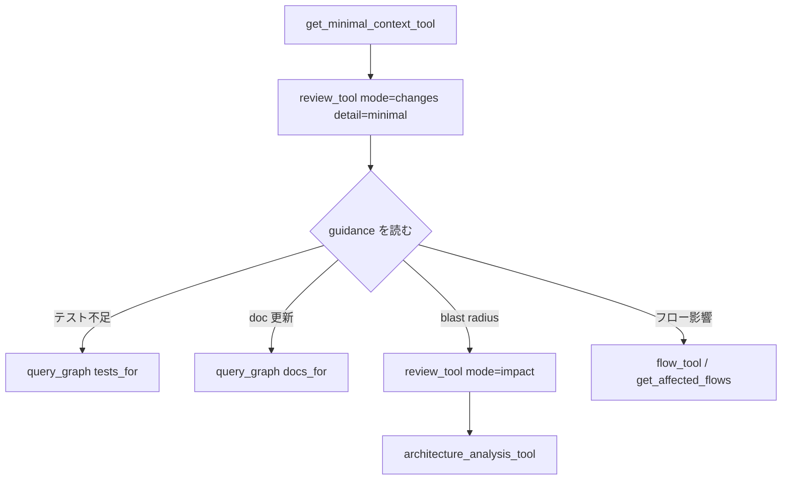

dagaynのレビュー支援は「差分から構造を読む」ことに焦点を当てる。ファイル全文ではなく、変更ノードとそのグラフ近傍をエージェントに渡す。

## 変更検出

`dagayn detect-changes` とMCP `review_tool(mode="changes")` は同じ変更検出エンジンを使う。

### 検出対象

| ソース | 内容 |
| --- | --- |
| `base_diff` | `git diff` 対 base ref |
| `staged` | ステージ済み変更 |
| `unstaged` | ワークツリー未ステージ |
| `untracked` | Git 未追跡ファイル（全体を新規として扱う） |

untrackedファイルにはline hunkが無いため、ファイル全体が変更として扱われる。

### レスポンスの構造

- `change_file_sources` — 上記バケット別のファイル一覧
- `changed_files` — 互換用のフラットリスト
- `change_status` — ノード / エッジごとに `existing` / `added` / `unknown`
- `change_entity_summary` — 種別ごとの件数集計

base refのdiffとローカルworktree変更を区別したいときは `change_file_sources` を見る。

## 推奨レビューフロー



1. **`get_minimal_context_tool`** — タスク向け最小コンテキスト
2. **`review_tool(mode="changes", detail_level="minimal")`** — 差分と `guidance` リスト
3. 必要なら **`detail_level="standard"`** でrawセクションを展開
4. **`guidance`** の `claim` / `evidence` / `confidence` / `action` に従って深掘り

`guidance` は次のような推奨を構造化して返す：

- 追加すべきテスト
- 更新すべきドキュメント
- アーキテクチャ上の注意
- 影響を受ける実行フロー

## Impact radius（影響範囲 / blast radius）

「このシンボルを変えたら、グラフ上で何に届くか」を調べる。

### 探索方向

| 方向 | 典型用途 |
| --- | --- |
| outgoing | 変更が下流に波及する範囲 |
| incoming | 誰がこのシンボルに依存しているか |
| 双方向 | レビュー時の総合的な影響 |

エッジkindでフィルタできる。依存分析では `CALLS` を除外し、impact分析では含める、といった使い分けが可能である。

### 実装方式

- **Recursive CTE** — 到達集合を一括取得（[ストレージと SQLite](/projects/dagayn/storage/) 参照）
- **Frontier batching** — kind重み付け、depth制限、token budget、応答整形が必要な場合

MCPでは `review_tool(mode="impact")` または `query_graph_tool` のtraversal系が相当する。

## 構造クエリとの組み合わせ

差分レビューでよく使う `query_graph_tool` パターン：

| pattern | 問い |
| --- | --- |
| `callers_of` | 誰が呼んでいるか |
| `callees_of` | 何を呼んでいるか |
| `tests_for` | テストはどこか |
| `docs_for` | 関連ドキュメントはどこか |
| `implementations_of` | この doc が説明するコードはどこか |
| `imports_of` | import 関係 |

変更ファイル内のシンボルから出発し、1〜2 hopだけたどるとトークン効率が良い。

## クロスアーティファクト追跡

Markdownの `CROSS_ARTIFACT` エッジを使うと、設計書変更の影響をコード側へ、コード変更の影響をdoc側へ追える。

```text
設計書のコードスパン更新
  → CROSS_ARTIFACT 先シンボル
  → callers / tests_for / flows
```

要件モデル（[rdra-ish](/projects/rdra-ish/)）と実装コードを同じリポジトリに置けば、上流から下流までグラフでたどれる。

## hook との連携

`dagayn install` が登録するhookは保存後に `dagayn update --skip-flows` を実行する。

| 変数 / 挙動 | 意味 |
| --- | --- |
| `DAGAYN_HOOK_UPDATE=1` | hook 経由の更新中 |
| 重複抑制 | 並行 hook はスキップ |
| 300秒タイムアウト | 大きな doc 変更でも kill されにくい |

MCPレビューはhook更新後のグラフを読む。鮮度は `dagayn status` または `list_graph_stats_tool` で確認する。

## レビュー観点チェックリスト

- **グラフ鮮度** — `status` で最終更新とノード数
- **差分網羅** — `change_file_sources` にuntrackedが含まれるか
- **テスト対応** — `tests_for` で変更シンボルをカバーしているか
- **doc 連携** — directiveと `CROSS_ARTIFACT` が意図どおりか
- **フロー影響** — 変更がエントリポイントフローに乗るか
- **アーキテクチャ** — hub / bridge / ADP違反が増えていないか

## 関連ページ

- [MCP ツール](/projects/dagayn/mcp-tools/)
- [構造メトリクス](/projects/dagayn/metrics/)
- [Markdown / Terraform 連携](/projects/dagayn/integrations/)
