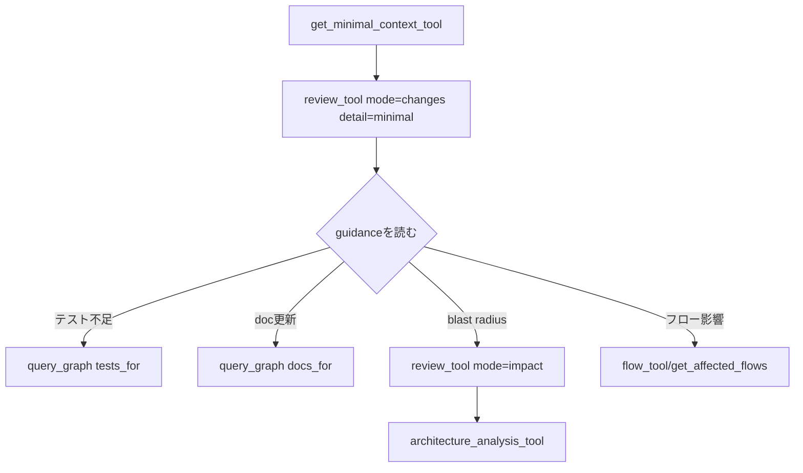

このページは、差分検出、impact radius、推奨レビューフローを扱います。変更検出のデータ構造はCLI/MCP共通です。MCPツールの引数は [MCP ツール](/projects/dagayn/mcp-tools/) へ。

## 変更検出

`dagayn detect-changes` とMCP `review_tool(mode="changes")` は同じ変更検出エンジンを使います。

### 検出対象

| ソース | 内容 |
| --- | --- |
| `base_diff` | `git diff` 対 base ref |
| `staged` | ステージ済み変更 |
| `unstaged` | ワークツリー未ステージ |
| `untracked` | Git 未追跡ファイル（全体を新規として扱う） |

untrackedファイルにはline hunkが無いため、ファイル全体が変更として扱われます。

### レスポンスの構造

- `change_file_sources`：上記バケット別のファイル一覧
- `changed_files`：互換用のフラットリスト
- `change_status`：ノード / エッジごとに `existing` / `added` / `unknown`
- `change_entity_summary`：種別ごとの件数集計

base refのdiffとローカルworktree変更を区別したいときは `change_file_sources` を見てください。

## 推奨レビューフロー


```mermaid
flowchart TD
  A[get_minimal_context_tool] --> B[review_tool mode=changes detail=minimal]
  B --> C{guidanceを読む}
  C -->|テスト不足| D[query_graph tests_for]
  C -->|doc更新| E[query_graph docs_for]
  C -->|blast radius| F[review_tool mode=impact]
  C -->|フロー影響| G[flow_tool/get_affected_flows]
  F --> H[architecture_analysis_tool]
```

1. **`get_minimal_context_tool`**：タスク向け最小コンテキスト
2. **`review_tool(mode="changes", detail_level="minimal")`**：差分と `guidance` リスト
3. 必要なら **`detail_level="standard"`** でrawセクションを展開
4. **`guidance`** の `claim` / `evidence` / `confidence` / `action` に従って深掘り

`guidance` は追加すべきテスト、更新すべきドキュメント、アーキテクチャ上の注意、影響を受ける実行フローを構造化して返します。

## Impact radius

「このシンボルを変えたら、グラフ上で何に届くか」を調べます。

### 探索方向

| 方向 | 典型用途 |
| --- | --- |
| outgoing | 変更が下流に波及する範囲 |
| incoming | 誰がこのシンボルに依存しているか |
| 双方向 | レビュー時の総合的な影響 |

エッジkindでフィルタできます。依存分析では `CALLS` を除外し、impact分析では含める使い分けが可能です。

### 実装方式

- **Recursive CTE**：到達集合を一括取得
- **Frontier batching**：kind重み付け、depth制限、token budget、応答整形が必要な場合

MCPでは `review_tool(mode="impact")` または `query_graph_tool` のtraversal系が相当します。

## 構造クエリとの組み合わせ

差分レビューでよく使う `query_graph_tool` パターン：

| pattern | 問い |
| --- | --- |
| `callers_of` | 誰が呼んでいるか |
| `callees_of` | 何を呼んでいるか |
| `tests_for` | テストはどこか |
| `docs_for` | 関連ドキュメントはどこか |
| `implementations_of` | この doc が説明するコードはどこか |
| `imports_of` | import 関係 |

変更ファイル内のシンボルから出発し、1〜2 hopだけたどるとトークン効率が良いです。

## クロスアーティファクト追跡

Markdownの `CROSS_ARTIFACT` エッジを使うと、設計書変更の影響をコード側へ、コード変更の影響をdoc側へ追えます。

```text
設計書のコードスパン更新
  → CROSS_ARTIFACT 先シンボル
  → callers / tests_for / flows
```

要件モデル（[rdra-ish](/projects/rdra-ish/)）と実装コードを同じリポジトリに置けば、上流から下流までグラフでたどれます。

## hookとの連携

`dagayn install` が登録するhookは保存後に `dagayn update --skip-flows` を実行します。

| 変数 / 挙動 | 意味 |
| --- | --- |
| `DAGAYN_HOOK_UPDATE=1` | hook 経由の更新中 |
| 重複抑制 | 並行 hook はスキップ |
| 300秒タイムアウト | 大きな doc 変更でも kill されにくい |

MCPレビューはhook更新後のグラフを読みます。鮮度は `dagayn status` または `list_graph_stats_tool` で確認してください。

## レビュー観点チェックリスト

- **グラフ鮮度**：`status` で最終更新とノード数
- **差分網羅**：`change_file_sources` にuntrackedが含まれるか
- **テスト対応**：`tests_for` で変更シンボルをカバーしているか
- **doc 連携**：directiveと `CROSS_ARTIFACT` が意図どおりか
- **フロー影響**：変更がエントリポイントフローに乗るか
- **アーキテクチャ**：hub / bridge / ADP違反が増えていないか

## 次に読む

MCPツールの一覧は [MCP ツール](/projects/dagayn/mcp-tools/) です。エッジkindの定義は [グラフモデル](/projects/dagayn/graph-model/) へ。
