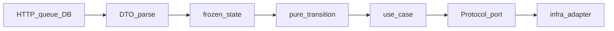

> ソースリポジトリ: [kamae-py](https://github.com/manji-0/kamae-py)

_Kamae（構え）— 備えの姿勢。_

Kamae Pythonは、サーバーサイドPython 3.12以降向けの設計スタンスとガイド集です。依存管理は**uv**、ドメイン状態は**Pydantic v2**の凍結モデルと`kind`判別共用体、状態変更は**純粋関数**を基本にします。

## 目的

`status: str`とOptionalだらけの無効状態、未検証dictや`typing.cast`の穴、想定内失敗の例外依存、ORMとドメインの混同、観測経路へのPII、状態とイベントの非アトミック保存を防ぎます。全部を通読する必要はなく、いま触っているトピックだけ開けば足ります。

## 背景

Pythonのサービスは境界が曖昧だと型チェッカーが「正しい」とみなし、ランタイムだけ不変条件が壊れます。KamaeはPydantic v2とpyreflyでモデルを固め、遷移を関数に閉じ、ポートで永続化を隠します。[kamae-rs](/projects/kamae-rs/)や[kamae-scala](/projects/kamae-scala/)と同系の骨格を、Pythonのイディオムに落とし込んだものです。

## 関連文書

| 文書 | 内容 |
| --- | --- |
| [使い方](/projects/kamae-py/usage/) | uv・pyrefly・スキル導入とテンプレート適用 |
| [ドメインモデリング](/projects/kamae-py/domain-modeling/) | 凍結state・ID・集約・配線・永続化の型 |
| [状態遷移](/projects/kamae-py/state-transitions/) | 純粋遷移・ユースケース・明示的エラー |
| [境界防御](/projects/kamae-py/boundary-defense/) | DTO・認可・PII・unsafe境界 |
| [ライブラリガイド](/projects/kamae-py/library-guides/) | FastAPI・Pydantic・SQLAlchemy・Hypothesis |
| [品質ゲート](/projects/kamae-py/quality-gates/) | Ruff・pyrefly・pytest・CI |
| upstream [SKILL.md](https://github.com/manji-0/kamae-py/blob/main/skills/kamae-py/SKILL.md) | エージェント向けディスパッチ |

## 目標

- ライフサイクル状態を判別共用体で表し、非法遷移を型で落とす
- 境界でだけ未知データをパースし、ドメイン深部へ未検証値を流さない
- 1コマンドで状態とドメインイベントを同じ整合境界に載せる
- ローカルとCIで同じ`uv run`コマンドを回せる

## 対象外

フロントエンド、スクリプト単発、インフラだけの変更、Pydantic v1の新規採用は対象外です。IDLからの機械生成だけが目的なら[kamae-model-translator](/projects/kamae-model-translator/)を見てください。

## シナリオ

1. 新規ワークフローで凍結stateと純粋遷移から始め、薄いユースケースとポート実装を足す
2. 既存の`status + Optional` blobをワークフロー単位で判別共用体へ置き換える
3. エージェントに`kamae-py`スキルを入れ、差分レビューで`kamae-py-review`を使う

## 構成

| 層 | 担当 |
| --- | --- |
| **Domain** | 凍結モデル・値オブジェクト・純粋遷移・エラーバリアント |
| **Application** | 非同期ユースケース・認可順序・オーケストレーション |
| **Infrastructure** | DB/HTTP/キュー/SDKアダプター（`Protocol`実装） |
| **Interface** | コントローラー・コンシューマー・CLI・コンポジションルート |



ブログ側は実装3本（モデリング・遷移・境界）とリファレンス3本（使い方・ライブラリ・品質）に集約しています。旧URLはリダイレクトで新ページへ誘導します。

## 制約

- Python **3.12+**、`pydantic>=2,<3`（ジェネリックモデルなら**2.11+**推奨）
- 型チェック既定は**pyrefly**（mypyではない）。厳しさはモデルの`ConfigDict`に書く
- パッケージ管理は**uv**。`pip`/`Poetry`/`requirements.txt`は既存規約がない限り導入しない
- ドメインパッケージはFastAPI・SQLAlchemy・boto3をimportしない

## インタフェース

- 人向け： 本サイトの`/projects/kamae-py/`配下
- エージェント： スキル`kamae-py`（実装）と`kamae-py-review`（レビュー）
- テンプレート： [skills/kamae-py/assets/templates/](https://github.com/manji-0/kamae-py/tree/main/skills/kamae-py/assets/templates/)
- ポリシー: `check_kamae_policy.py`（凍結モデル・`kind`・純粋遷移・危険パターン）

## 依存

| 種別 | 既定 |
| --- | --- |
| ランタイム | Pydantic v2 |
| ツール | uv、Ruff、pyrefly、pytest |
| HTTP例 | FastAPI（インターフェース層のみ） |
| 永続化例 | SQLAlchemy 2.0（アダプター内） |
| 観測例 | OpenTelemetry（任意のプルエンドポイントは別） |

## 検討して捨てた案

1. **ページをトピックごとに細分化** — 読み順が散らばるため、実装3本＋リファレンス3本に統合しました
2. **mypy＋Pydanticプラグインを既定** — pyreflyの組み込みサポートに一本化しました
3. **重いDIコンテナを既定** — プレーンな関数引数とコンポジションルートを優先しました
4. **ドメインモデルをAPI JSONと共通化** — 迷ったときはDTO分離を選びます

## 次に読む

| 目的 | ページ |
| --- | --- |
| 環境とスキルを入れる | [使い方](/projects/kamae-py/usage/) |
| 型でstateを起こす | [ドメインモデリング](/projects/kamae-py/domain-modeling/) → [状態遷移](/projects/kamae-py/state-transitions/) |
| 境界とPII | [境界防御](/projects/kamae-py/boundary-defense/) |
| 仕上げのチェック | [品質ゲート](/projects/kamae-py/quality-gates/) |

実装時は次でスキルを入れられます。

```bash
npx skills add manji-0/kamae-py -s kamae-py -s kamae-py-review -g -y
```

チームの命名やライブラリ好みは`.claude/rules/` / `.codex/rules/`で上書きできます。
