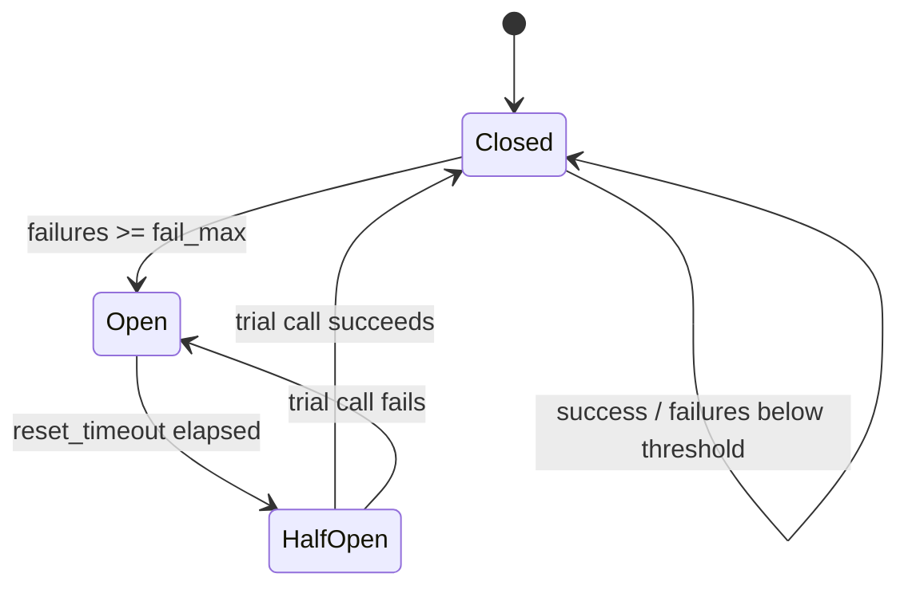

リトライ、タイムアウト、サーキットブレーカーは**インフラアダプター**の関心事である。ドメイン遷移やユースケースに置くと、ビジネス上リトライすべきでない失敗（認可拒否、バリデーション）まで隠し、冪等性のないコマンドが二重適用される。

エラーの層分けは [エラーハンドリング](/projects/kamae-py/error-handling/)、冪等キーとアウトボックスは [永続化、集約、イベント](/projects/kamae-py/persistence-events/)、ポートの形は [アプリケーション配線](/projects/kamae-py/application-wiring/) と整合させる。

## レイヤーごとの責務

| 関心事 | レイヤー | 表現 |
| --- | --- | --- |
| 「リクエストが見つからない」 | Application / domain | `Err(RequestNotFound(...))` |
| パートナー API からの一時的 HTTP 503 | Infrastructure | バックオフ付きリトライ、その後 raise またはマップ |
| DB 接続タイムアウト | Infrastructure | raise。フレームワークまたはジョブランナーがリトライしうる |
| リトライ時の重複コマンド | Application + persistence | 冪等性キー（[永続化、集約、イベント](/projects/kamae-py/persistence-events/) を参照） |

ドメインコードは `tenacity`、サーキットブレーカーライブラリ、HTTPクライアントリトライミドルウェアをインポートしてはならない。

## リトライ

アダプター境界で [tenacity](https://github.com/jd/tenacity) またはHTTPクライアントの組み込みリトライ方針を使う。

```bash
uv add tenacity
```

**一時的で冪等**な操作だけをリトライする：

- 副作用のない安全なGET/読み取り呼び出し。
- 冪等性キーとデータベース重複排除を含む書き込み。
- コミット後のアウトボックスリレー公開。

冪等性保護なしに二重課金、二重割当、重複通知を起こしうるユースケースを盲目的にリトライしない。

```python
from tenacity import retry, stop_after_attempt, wait_exponential


@retry(stop=stop_after_attempt(3), wait=wait_exponential(multiplier=0.5, max=8))
async def fetch_driver_profile(client: httpx.AsyncClient, driver_id: UUID) -> DriverProfileDto:
    response = await client.get(f"/drivers/{driver_id}", timeout=5.0)
    response.raise_for_status()
    return DriverProfileDtoAdapter.validate_python(response.json())
```

枯渇したリトライをアダプターエッジで安定したインフラ例外またはユースケースエラーにマップする。生の `httpx` またはドライバー例外型をポートプロトコル経由で漏らさない。

インフラ失敗が例外のままか `Err` になるかは [エラーハンドリング](/projects/kamae-py/error-handling/) を読む。

### Tenacity 戦略決定表

| シナリオ | `stop` | `wait` | `retry` 述語 | 備考 |
| --- | --- | --- | --- | --- |
| 冪等 GET / 読み取り | `stop_after_attempt(3–5)` | `wait_exponential(multiplier=0.5, max=8)` | HTTP 502/503/504、タイムアウト | パートナー読み取りの安全なデフォルト |
| アウトボックス公開 | `stop_after_attempt(10)` | exponential + jitter | ブローカーエラー、タイムアウト | コンシューマー側 `event_id` 重複排除と組み合わせる |
| 起動時 DB 接続 | `stop_after_delay(60)` | fixed 1s | `OperationalError` | コンポジションルートのみ |
| 決済 / charge POST | **盲目的リトライなし** | — | — | 冪等性キー + `409`/既知安全レスポンス後の単一リトライのみ |
| 楽観的ロック競合 | アダプターで**リトライしない** | — | — | ユースケースが再読み込みして判断 |
| レート制限 429 | `stop_after_attempt(5)` | `wait_exponential` + `Retry-After` 尊重 | 429 のみ | 合計待機を SLA 以下に上限 |

```python
from tenacity import retry, retry_if_exception_type, stop_after_attempt, wait_exponential


@retry(
    retry=retry_if_exception_type(httpx.TimeoutException),
    stop=stop_after_attempt(3),
    wait=wait_exponential(multiplier=0.5, max=8),
    reraise=True,
)
async def fetch_with_timeout(...) -> DriverProfileDto:
    ...
```

`before_sleep` ロギングに相関IDを入れる。レスポンスボディは入れない。`wait_random_exponential` のジッターは、共有依存関係へのサンダリング・ヘアドを抑える。

## タイムアウト

発信呼び出しに上限がないと、1つの遅い依存がワーカーやイベントループ全体を占有し、ユーザーには「全体が遅い」ように見える。HTTPクライアント、DBステートメント、キューポール、SDK操作には、それぞれ明示的なタイムアウトを設定する。

- クライアントでリクエストごとのタイムアウトを優先（httpx/aiohttpの `timeout=...`）。
- タイムアウトがビジネスルールの一部である場合を除き（これは稀である）、ドメイン層とユースケース関数から `asyncio.wait_for` を除く。
- 呼び出し側が最悪レイテンシを知る必要があるとき、ポートプロトコルにSLA期待を文書化する。

```python
async with httpx.AsyncClient(timeout=httpx.Timeout(5.0, connect=2.0)) as client:
    ...
```

## サーキットブレーカー

下流の依存関係が継続的に失敗するときは、高速失敗でサービスを保護し、リトライ嵐を避けるためにサーキットブレーカーを使う。

よくあるライブラリ：

- `pybreaker`
- サービスメッシュまたはAPIゲートウェイの耐障害機能（すでに標準化されているなら優先）

**アダプター実装**を包む。ユースケースではない：

```python
breaker = CircuitBreaker(fail_max=5, reset_timeout=30)


async def call_partner_api(...) -> PartnerResponseDto:
    return await breaker.call_async(_do_call, ...)
```

ブレーカーがopenのときは、安定した劣化モードエラーを返すか、後で処理するようキューに入れる。ブレーカー状態をドメインライフサイクル状態として表現しない。

### サーキットブレーカー状態機械



| 状態 | 振る舞い | 呼び出し側の体験 |
| --- | --- | --- |
| **Closed** | すべての呼び出しが通過。失敗をカウント | 通常レイテンシまたはマップ済みエラー |
| **Open** | 依存に当たらず高速失敗 | 安定した `ServiceUnavailable` / キュー投入 |
| **Half-open** | 1 回の試行呼び出しのみ許可 | 成功で close、失敗で再 open |

設定指針：

- `fail_max`: HTTPパートナーでは連続失敗5–10。エラーバジェットから調整。
- `reset_timeout`: 30–120s。非クリティカル読み取りは短く、過負荷コアは長く。
- すでにデプロイ済みならmesh/ゲートウェイブレーカーを優先。すべての呼び出し側を保護する。
- メトリクスを発行： `breaker_state`、`breaker_trips_total`、`breaker_rejected_calls_total`。
- **closed** 状態の内側でのみtenacityと組み合わせる。open状態と戦うネストリトライループは作らない。

## 冪等性とアウトボックスとの相互作用

インフラレイヤーのリトライは、アプリケーション冪等性を**補完**するが置き換えない：

1. ユースケースがビジネス前提条件を確認し、状態 + イベントを構築する。
2. リポジトリが `idempotency_key` とバージョンチェック付きで原子性保存する。
3. アウトボックスワーカーが独自のバックオフで公開をリトライする。
4. 外部APIアダプターは操作が安全またはキー付きのときだけリトライする。

N回失敗してから成功するフェイクでリトライパスをテストし、重複配信下での一意制約と冪等性キーを統合テストで検証する。

## レビューで見るところ

- 副作用のあるリトライ・アウトボックス・外部呼び出しに冪等キーや重複排除があるか（[永続化、集約、イベント](/projects/kamae-py/persistence-events/)）。
- タイムアウトとサーキットブレーカーがアダプターで明示されているかも見る。
- リトライやブレーカーがドメイン遷移に入り込んでいないか、バリデーション拒否まで広い例外で隠していないかも確認する。

