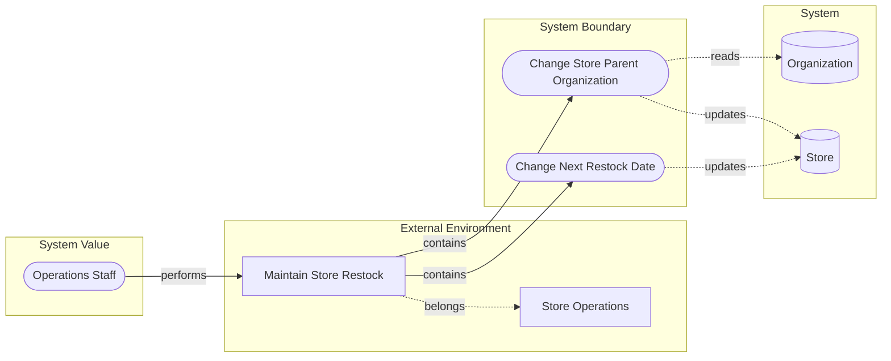
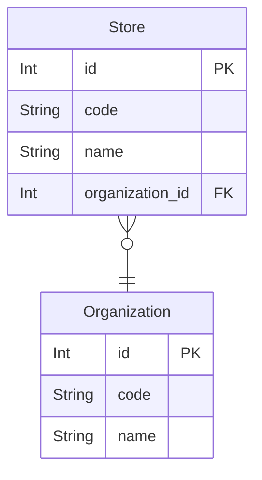

<!-- derived-from ../incremental-modeling.md#Stage-一覧 -->

店舗運営部の「補充予定と担当組織の維持」を題材に、要求分析からエンティティ構造・ライフサイクル・業務ルールまでをStage 0–6で一気に追う。[段階的モデリング](/projects/rdra-ish/incremental-modeling/) の概念表に対する実践ウォークスルーで、ソースはupstreamの [`samples/incremental-order`](https://github.com/manji-0/rdra-ish-dsl/tree/main/samples/incremental-order) である。

## 前提

各Stageは独立した `src/` を持つ。前段を上書きせず、その段階のモデルだけを `check` する。

```text
samples/incremental-order/
  step-0-scope/src/
  step-1-buc-skeleton/src/
  ...
  step-6-business-rules/src/
    shared/   # actors, biz, entities
    buc/      # buc_store_restock.rdra
```

クローン後は次のルートで試せる。

```bash
git clone https://github.com/manji-0/rdra-ish-dsl.git
cd rdra-ish-dsl
```

以下、パスは `samples/incremental-order/` からの相対とする。

## Stage 0 — スコープ

<!-- derived-from ../incremental-modeling.md#Stage-一覧 -->

**要求の焦点:** 店舗補充管理を店舗運営業務のスライスとして切り、画面やデータを置くより先に業務名と境界をレビューできること。

追加するのは業務領域とBUC名だけ。

```rdra
// shared/biz.rdra
business StoreOperations "Store Operations"

// buc/buc_store_restock.rdra
buc BucStoreRestock "Maintain Store Restock"
belongs(BucStoreRestock, StoreOperations)
```

```bash
rdra-ish check step-0-scope/src
```

この段階で固定する語彙は `StoreOperations` と `BucStoreRestock`。発注実行・在庫引当・配送は対象外のままにする。

## Stage 1 — BUC 骨格

**要求の焦点:** 店舗運営の担当者が実行主体として見え、補充予定日の変更と担当組織変更を別ユースケースとしてレビューできること。

```rdra
actor OpsStaff "Operations Staff"

usecase ChangeNextRestockDate "Change Next Restock Date"
usecase ChangeStoreParentOrganization "Change Store Parent Organization"

performs(OpsStaff, BucStoreRestock)
contains(BucStoreRestock, ChangeNextRestockDate)
contains(BucStoreRestock, ChangeStoreParentOrganization)
```

```bash
rdra-ish check step-1-buc-skeleton/src
rdra-ish diagram step-1-buc-skeleton/src --kind rdra --format mermaid --buc BucStoreRestock
```

データや画面はまだ置かない。UCの粒度が業務担当者にとって別作業か、だけを見る。

## Stage 2 — データ接点

**要求の焦点:** 粗いエンティティとUC直結のCRUDで、どの操作がどのデータに触るか説明できること。

```rdra
entity Store "Store" {
  id: Int @pk
}
entity Organization "Organization" {
  id: Int @pk
}

updates(ChangeNextRestockDate, Store)
reads(ChangeStoreParentOrganization, Organization)
updates(ChangeStoreParentOrganization, Store)
```

```bash
rdra-ish check step-2-data-touchpoints/src
rdra-ish csv step-2-data-touchpoints/src --kind matrix
rdra-ish diagram step-2-data-touchpoints/src --kind rdra --format mermaid --buc BucStoreRestock
```

CRUDマトリクスのイメージ：

```csv
UseCase,Organization,Store
ChangeNextRestockDate,,U
ChangeStoreParentOrganization,R,U
```

オブジェクト関係のイメージ：



カラム詳細やAPIはまだ入れない。Organizationは参照のみ（担当組織マスタ自体の変更ではない）。

## Stage 3 — 相互作用境界

**要求の焦点:** 担当者がどの画面から操作し、担当組織変更では店舗更新と組織参照を別API境界として見える化できること。補充予定日の変更は過剰なAPI化を避けてよい。

```rdra
screen StoreMaintenanceScreen "Store Maintenance"
api StoreAdminApi "Store Admin API"
api OrganizationLookupApi "Organization Lookup API"
system StoreAdminSystem "Store Admin System"
system OrganizationSystem "Organization System"

timing StoreMasterMaintenanceWindow "Store Master Maintenance Window"
location BackOffice "Back Office"
medium OpsConsole "Operations Console"
permission StoreMaintenanceWrite "Store Maintenance Write"

belongs(BucStoreRestock, StoreOperations)
  .when(StoreMasterMaintenanceWindow)
  .where(BackOffice)
  .by(OpsConsole)
has_permission(OpsStaff, StoreMaintenanceWrite)

displays(ChangeNextRestockDate, StoreMaintenanceScreen)
updates(ChangeNextRestockDate, Store)
requires_permission(ChangeNextRestockDate, StoreMaintenanceWrite)
requires_medium(ChangeNextRestockDate, OpsConsole)

displays(ChangeStoreParentOrganization, StoreMaintenanceScreen)
contains(StoreAdminSystem, StoreAdminApi)
contains(OrganizationSystem, OrganizationLookupApi)
invokes(ChangeStoreParentOrganization, StoreAdminApi)
invokes(ChangeStoreParentOrganization, OrganizationLookupApi)
updates(StoreAdminApi, Store)
reads(OrganizationLookupApi, Organization)
```

```bash
rdra-ish check step-3-interaction-boundary/src
rdra-ish csv step-3-interaction-boundary/src --kind actor-permission-audit
rdra-ish csv step-3-interaction-boundary/src --kind screen-constraints
```

direct CRUD（補充予定日）とAPI CRUD（担当組織変更）の混在は、この段階の判断として残す。

## Stage 4 — エンティティ構造

**要求の焦点:** 店舗・組織の業務識別子とN:1関係をERとしてレビューし、境界越え関係の調整責務をユースケースに明示できること。

```rdra
entity Store "Store" {
  id: Int @pk
  code: String @unique
  name: String
}
entity Organization "Organization" {
  id: Int @pk
  code: String @unique
  name: String
}

relate(Store, Organization, N:1)
coordinates(ChangeStoreParentOrganization, Store, Organization)
```

```bash
rdra-ish check step-4-entity-structure/src
rdra-ish diagram step-4-entity-structure/src --kind er --format mermaid
```

生成されるERのイメージ：



## Stage 5 — ライフサイクル

**要求の焦点:** 補充状態（normal / scheduled / blocked）と次回の補充予定日の有無を、同じイベントで説明し到達検証できること。

```rdra
entity Store "Store" {
  id: Int @pk
  code: String @unique
  name: String
  restock_status: Enum(normal, scheduled, blocked) @default(normal)
  next_restock_date: DateTime @null
}

event RestockScheduled "Restock Scheduled"
event RestockBlocked "Restock Blocked"

transitions(Store.restock_status, event::RestockScheduled, normal -> scheduled)
transitions(Store.restock_status, event::RestockBlocked, scheduled -> blocked)
sets(event::RestockScheduled, Store, next_restock_date == present)
sets(event::RestockBlocked, Store, next_restock_date == null)

usecase BlockScheduledRestock "Block Scheduled Restock"
raises(ChangeNextRestockDate, event::RestockScheduled)
raises(BlockScheduledRestock, event::RestockBlocked)
```

```bash
rdra-ish check step-5-lifecycle/src
rdra-ish states step-5-lifecycle/src --entity Store
rdra-ish diagram step-5-lifecycle/src --kind event-flow --format mermaid --buc BucStoreRestock
```

blockedからnormalへ戻すUCは、このサンプルではまだ入れない。

## Stage 6 — 業務ルール

**要求の焦点:** scheduledには予定日が必要、blockedに予定日を残してはいけない、をDSL上の制約として検出し、状態到達表で違反がないことを確認できること。

```rdra
forbidden(Store, restock_status == blocked, next_restock_date == present)

invariant(Store)
  .when(restock_status == scheduled)
  .then(next_restock_date == present)
```

```bash
rdra-ish check step-6-business-rules/src
rdra-ish states step-6-business-rules/src --entity Store
```

`normal + present` は禁止しない（業務上許容する判断）。比較や時間性質まで厳密に見る場合は [形式検証](/projects/rdra-ish/formal-verification/) へ進む。

## 最終形の骨格

Stage 6のBUC側の関係は次の形に収束する。

```rdra
module buc.store_restock

import shared.biz
import shared.actors
import shared.entities

buc BucStoreRestock "Maintain Store Restock"
usecase ChangeNextRestockDate "Change Next Restock Date"
usecase ChangeStoreParentOrganization "Change Store Parent Organization"
usecase BlockScheduledRestock "Block Scheduled Restock"
screen StoreMaintenanceScreen "Store Maintenance"
api StoreAdminApi "Store Admin API"
api OrganizationLookupApi "Organization Lookup API"
system StoreAdminSystem "Store Admin System"
system OrganizationSystem "Organization System"

belongs(BucStoreRestock, StoreOperations)
  .when(StoreMasterMaintenanceWindow)
  .where(BackOffice)
  .by(OpsConsole)
performs(OpsStaff, BucStoreRestock)
has_permission(OpsStaff, StoreMaintenanceWrite)
contains(BucStoreRestock, ChangeNextRestockDate)
contains(BucStoreRestock, ChangeStoreParentOrganization)
contains(BucStoreRestock, BlockScheduledRestock)

displays(ChangeNextRestockDate, StoreMaintenanceScreen)
updates(ChangeNextRestockDate, Store)
raises(ChangeNextRestockDate, event::RestockScheduled)

displays(ChangeStoreParentOrganization, StoreMaintenanceScreen)
invokes(ChangeStoreParentOrganization, StoreAdminApi)
invokes(ChangeStoreParentOrganization, OrganizationLookupApi)
updates(StoreAdminApi, Store)
reads(OrganizationLookupApi, Organization)
coordinates(ChangeStoreParentOrganization, Store, Organization)

displays(BlockScheduledRestock, StoreMaintenanceScreen)
updates(BlockScheduledRestock, Store)
raises(BlockScheduledRestock, event::RestockBlocked)
```

エンティティ側の制約・遷移はStage 5–6の抜粋をそのまま共有モジュールに置く。

## まとめ

<!-- derived-from #Stage-0--スコープ -->
<!-- derived-from #Stage-1--BUC-骨格 -->
<!-- derived-from #Stage-2--データ接点 -->
<!-- derived-from #Stage-3--相互作用境界 -->
<!-- derived-from #Stage-4--エンティティ構造 -->
<!-- derived-from #Stage-5--ライフサイクル -->
<!-- derived-from #Stage-6--業務ルール -->

実務のループは次のとおり。

1. 要求をそのStageの焦点に絞る（Mustだけ先に固定する）
2. 差分だけ `.rdra` に足す
3. `check` と `--buc` 付きdiagram / csv / `states` でレビューする
4. 次Stageへ進む（warningは探索信号、errorはブロッカー）

Stageの定義とディレクトリ規約の正本は [段階的モデリング](/projects/rdra-ish/incremental-modeling/)。構文は [言語リファレンス](/projects/rdra-ish/language-reference/)、図表は [図表とエクスポート](/projects/rdra-ish/diagram-and-export/)、状態の厳密検証は [形式検証](/projects/rdra-ish/formal-verification/)。フル差分は [`samples/incremental-order`](https://github.com/manji-0/rdra-ish-dsl/tree/main/samples/incremental-order) の各stepの `requirements-analysis.md` と `design.md` を参照。
