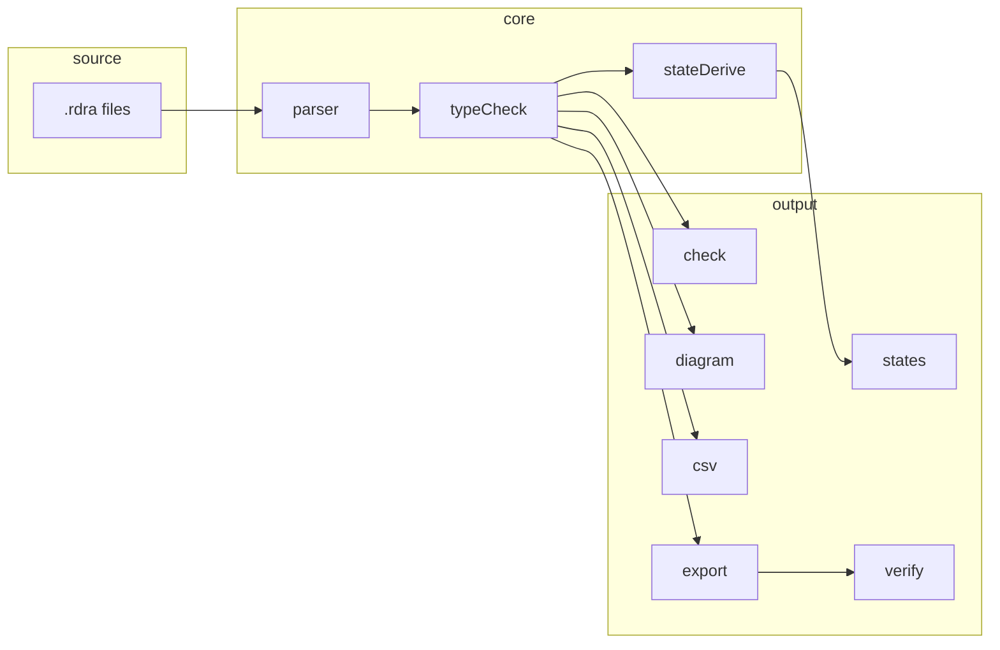

> ソースリポジトリ: [rdra-ish-dsl](https://github.com/manji-0/rdra-ish-dsl) · 対象バージョン: **v0.2.0**

**rdra-ish** は、要件モデルを `.rdra` で書いて、型チェック・図表・状態導出・形式検証まで同じモデルから回すCLIとコンパイラ群です。

## 目的

Wordや表に散らばりがちな「誰が・何を・どのデータに触るか」を、関係（predicate）で結んだグラフとしてコードに残し、レビューしやすくします。

## 背景

ベースにあるのは **RDRA**（Relationship-Driven Requirements Analysis）です。アクターやBUC、ユースケース、画面、エンティティなどを宣言し、`performs` や `contains`、`creates` といった関係で明示的につなぐ書き方です。rdra-ishは **RDRA-ISH** 寄りに読み替え、システム境界やAPI、アクセス制約、エンティティのライフサイクルなど、実装レビューに効く語彙を足しています。

## 関連文書

| 文書 | 内容 |
| --- | --- |
| [使い方](/projects/rdra-ish/usage/) | インストールと初回の一周 |
| [段階的モデリング](/projects/rdra-ish/incremental-modeling/) | Stage 0–6 の精緻化フロー |
| [形式検証](/projects/rdra-ish/formal-verification/) | `export --kind tla` と `verify --backend tlc` |
| upstream [CHANGELOG](https://github.com/manji-0/rdra-ish-dsl/blob/main/CHANGELOG.md) | 破壊的変更の一覧 |

## 目標

- 同じ `.rdra` から `check`、diagram、CSV、`states`、各種 `export` を出せる
- BUC単位でCRUDマトリクスやシーケンス、状態到達性をモデルから生成する
- ライフサイクルを厳密に見たいときはTLA+/TLCへ渡せる

## 対象外

関係を明示したモデルをレビューしやすくするためのツールです。議事録やユーザーストーリーだけの初期探索、本番マイグレーションの代替には向きません。

## シナリオ

1. Stage 0から段階的に `.rdra` を足し、各段階のあと `check` と `--buc` 付きdiagramでレビューする
2. CRUDマトリクスとシーケンス図でBUCのギャップを洗い、`states` でライフサイクルを確認する
3. `export --kind openapi` や `dbml` でたたき台を出し、差分を実装と揃える

## 構成

BUCはビジネス価値のスライス、ビジネスフローは時間順の展開、ユースケースは効果を持つ相互作用の境界です。実務ではBUCで切り、フローで順番を追い、UCで1操作とそのデータ・画面・API効果に名前を付けます。

## 制約

- 生成系サブコマンド（`diagram` / `csv` / `list` / `export` / `states` / `verify`）はモデルにerrorがあるとき **fail-closed** です
- `warning` はレビュー信号（探索中は意図的に残してよい）
- `error` はモデル信頼性を損なうためブロッカーです
- `--buc` フィルタで1スライスだけ検証できます

## インタフェース

- CLI: `rdra-ish <subcommand> <inputs...>`
- エディタ： VS Code拡張と `rdra-ish-lsp`（[CLI リファレンス](/projects/rdra-ish/cli-reference/)）
- 形式検証： `export --kind tla` → `verify --backend tlc`（TLCは別途PATH）

## 依存

- Rust製CLI。PyPI/uv経由の `rdra-ish` バイナリが主な配布経路です
- diagramのMermaid出力は追加依存なし。PlantUMLはJavaと `plantuml.jar` が要ります
- TLA+/TLCは [形式検証](/projects/rdra-ish/formal-verification/) の手順で別途入れます

## 検討して捨てた案

1. **RDRA原典の完全互換** — 実装レビュー向けの語彙を足したRDRA-ISHとして切りました
2. **単一の巨大 `.rdra`** — Stage 0–6と `shared/` / `buc/` 配置で段階的精緻化を採用しました
3. **生成物を正とする運用** — exportはレビュー起点のたたき台とし、モデル更新後の再生成を前提にしました

## 次に読む

| 目的 | ページ |
| --- | --- |
| まず動かす | [使い方](/projects/rdra-ish/usage/) |
| 書き方を段階的に学ぶ | [段階的モデリング](/projects/rdra-ish/incremental-modeling/) |
| 要求からルールまで追う | [店舗補充管理の例](/projects/rdra-ish/examples/store-restock/) |
| 構文を引く | [言語リファレンス](/projects/rdra-ish/language-reference/) |

上流の要件モデルがrdra-ish、横断トレースが [dagayn](/projects/dagayn/)、実装のドメイン設計がkamae系、という並びで使うことが多いです。サンプルはリポジトリの `samples/` にあります（`incremental-order`、`ec-site`、`clinic-ops`、`personal-info`、`formal-verification/`）。
