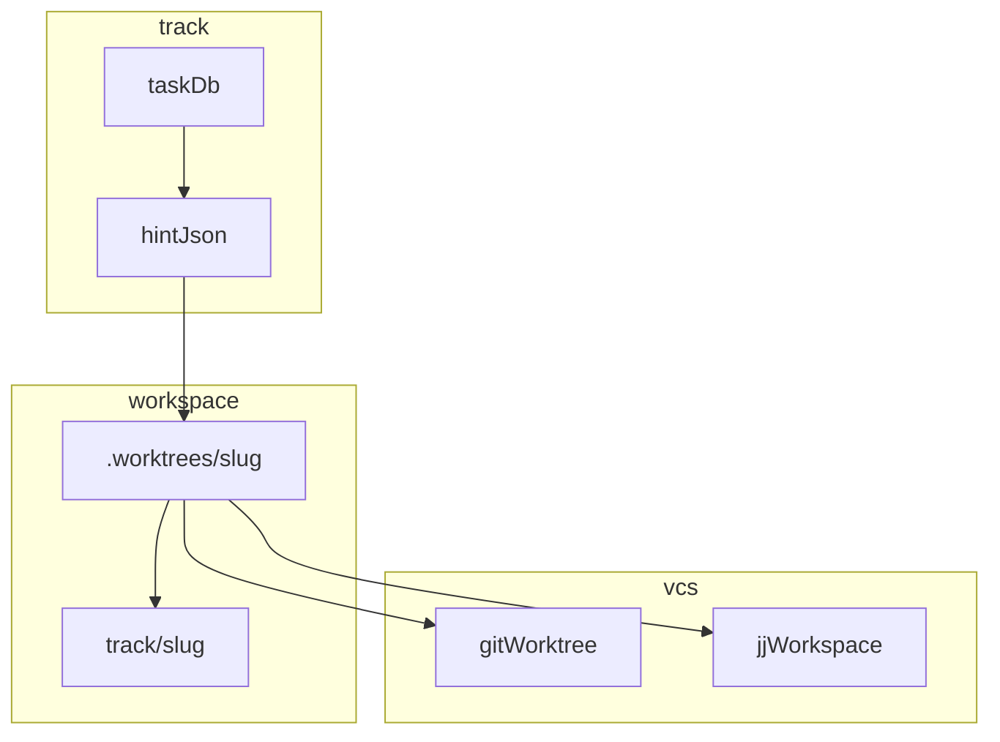

> ソースリポジトリ: [track](https://github.com/manji-0/track) · 対象バージョン: **v0.9.0**

**track** は、いま着手している開発タスクをコンテキストとして束ね、コーディング用ワークスペースまで所有する軽量CLIです。

## 目的

チケット・TODO・スクラップ・作業リポジトリをタスク単位でまとめ、`track switch` で切り替えたあとの操作をそのタスクに関連付けます。

## 背景

エージェントや人手の開発では、チケットURLと手元のTODOが別管理になり、作業ディレクトリもリポジトリルートに散らばりがちです。`git worktree` や `jj workspace add` を各自で叩く運用は、slugやPR headのずれを生みます。

## 関連文書

| 文書 | 内容 |
| --- | --- |
| [ワークスペース](/projects/track/workspace/) | `.worktrees/<slug>` と `track/<slug>` の契約 |
| [エージェント](/projects/track/agents/) | スキル、`--json`、`workflow.phase` |
| [使い方](/projects/track/usage/) | インストールと初回の一周 |
| upstream [DESIGN.md](https://github.com/manji-0/track/blob/main/DESIGN.md) | 実装の設計メモ |
| upstream [JJ_INTEGRATION.md](https://github.com/manji-0/track/blob/main/docs/JJ_INTEGRATION.md) | git / jj の詳細 |

## 目標

- タスク切替のたびに、次に入るディレクトリを `hint.next_command` で機械可読に示す
- PR headを常に `track/<slug>` に揃え、メインのチェックアウトで実装しない
- aggressive modeでTODO 1件あたり1コミットとgit notesを選べる

## 対象外

タスク単位の作業コンテキストとワークスペースを束ねるCLIです。スプリント計画、issueトラッキング、複数エージェントのプランニングには向きません。

## シナリオ

1. チケット付きタスクを作り、リポジトリを登録して `.worktrees/<slug>/` で実装し、PRを出して `track archive` する
2. エージェントが `track status --json` を読み、`workflow.phase` に沿ってワークスペースへ入る
3. `track switch today` で前日の未完了TODOを持ち越し、Web UIで一覧する

## 構成

| 層 | 担当 |
| --- | --- |
| **何をやるか** | track（タスク、TODO、スクラップ、チケット、JSONのworkflowとhint） |
| **どこで書くか** | track（`.worktrees/<slug>/`、ブランチ／bookmark `track/<slug>`） |
| **どうコミットするか** | そのワークスペース内のgitまたはjj |

`git worktree`、`jj workspace add`、`jj-task` は手で叩きません。契約は [ワークスペース](/projects/track/workspace/) です。

## 制約

- 新規DBの既定は `vcs-mode=git` です
- 既存DBでタスクがあり `vcs-mode` を一度も書いていないものは **jj** のままです
- 実装は例外なく `.worktrees/<slug>/` の中で行います
- `track archive --force` はdirtyチェックを飛ばすだけで、ディレクトリは削除されます

## インタフェース

- CLI: `track <subcommand>`（mutatingは `--json` 可）
- エージェント： スキル `track` / `track-task-setup` / `track-task-execute` / `track-advanced` と `track llm-help`
- ブラウザ： `track webui`（[Web UI](/projects/track/webui/)）
- 永続化： SQLite（`$HOME/.local/share/track/track.db`、XDG Base Directory）

## 依存

- Rust（Edition 2024、MSRV 1.88）、clap、rusqlite（bundled）
- Web UIはAxum、MiniJinja、HTMX 2、SSE
- コミットはワークスペース内のgitまたはjj（colocated）に委ねます

## 検討して捨てた案

1. **TODOごとのworktree**：v0.9でタスクあたりワークスペース1つに統合しました（`track todo add --worktree` は削除）
2. **jj-taskへの委譲**：`~/.config/jj/task-workspaces.json` を読まず、Track DBとファイルシステムで所有します
3. **MCPサーバー**：入口はスキルと `--json` に絞り、プロトコル実装は持ちません

## 次に読む

| 目的 | ページ |
| --- | --- |
| まず動かす | [使い方](/projects/track/usage/) |
| ワークスペースの契約 | [ワークスペース](/projects/track/workspace/) |
| エージェントから使う | [エージェント](/projects/track/agents/) |
| コマンドを探す | [CLI リファレンス](/projects/track/cli-reference/) |

ライセンスはMITです。
